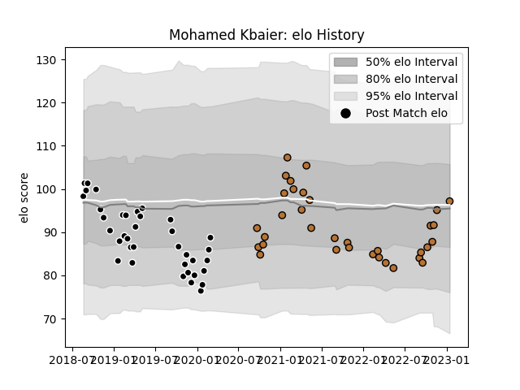

---  
layout: page  
title: Mohamed Kbaier  
date: 2023-01-17 11:37:07.520592  
categories: player  
---
# Mohamed Kbaier

## Positions: L

## Current elo: 97.0

## Current Percentile: 48.0

# Elo History

# Match History

| Team           |   Appearances |   Win Rate |
|:---------------|--------------:|-----------:|
| Provence Rugby |            37 |   0.459459 |
| Narbonne       |            34 |   0.514706 |

| Opponent                   |   Matches |   Win Rate |
|:---------------------------|----------:|-----------:|
| US Bressane                |         5 |   0.6      |
| Nevers                     |         4 |   0.5      |
| Aurillac                   |         4 |   0.5      |
| Colomiers                  |         4 |   0.5      |
| Vannes                     |         3 |   0.333333 |
| Massy                      |         3 |   0.666667 |
| Cognac Saint Jean d'Angély |         3 |   1        |
| Mont-de-Marsan             |         3 |   0.333333 |
| Soyaux-Angouleme           |         3 |   0        |
| Bourgoin-Jallieu           |         3 |   0.666667 |
| Suresnes                   |         3 |   0.666667 |
| Biarritz Olympique         |         3 |   0.333333 |
| Rouen                      |         2 |   0.5      |
| Oyonnax                    |         2 |   0.5      |
| Nice                       |         2 |   1        |
| Tarbes                     |         2 |   1        |
| Roval Drome XV             |         2 |   1        |
| Aubenas                    |         2 |   0.5      |
| Montauban                  |         2 |   1        |
| Dax                        |         2 |   0.5      |
| Chambery                   |         2 |   0        |
| Carcassonne                |         2 |   0        |
| Blagnac                    |         2 |   0.75     |
| Beziers                    |         2 |   0        |
| Bayonne                    |         2 |   0        |
| Dijon                      |         1 |   0        |
| Brive                      |         1 |   0        |
| Valence Romans Drome Rugby |         1 |   0        |
| Grenoble                   |         1 |   0        |