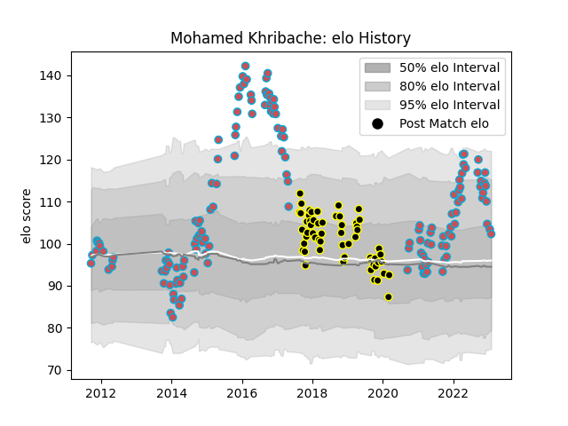

---  
layout: page  
title: Mohamed Khribache  
date: 2023-01-17 11:40:36.406095  
categories: player  
---
# Mohamed Khribache

## Positions: H

## Current elo: 103.0

## Current Percentile: 75.0

# Elo History

# Match History

| Team             |   Appearances |   Win Rate |
|:-----------------|--------------:|-----------:|
| Bourgoin-Jallieu |           146 |   0.414384 |
| Mont-de-Marsan   |            57 |   0.508772 |

| Opponent                   |   Matches |   Win Rate |
|:---------------------------|----------:|-----------:|
| Narbonne                   |        13 |   0.423077 |
| Albi                       |        12 |   0.166667 |
| Dax                        |        10 |   0.6      |
| Beziers                    |        10 |   0.6      |
| Tarbes                     |         9 |   0.444444 |
| Soyaux-Angouleme           |         9 |   0.222222 |
| Aurillac                   |         9 |   0.5      |
| Carcassonne                |         9 |   0.666667 |
| Mont-de-Marsan             |         9 |   0.444444 |
| Massy                      |         8 |   0.375    |
| Perpignan                  |         8 |   0.375    |
| Colomiers                  |         8 |   0.5      |
| Biarritz Olympique         |         7 |   0.285714 |
| Provence Rugby             |         6 |   0.333333 |
| Montauban                  |         6 |   0.666667 |
| Vannes                     |         6 |   0.416667 |
| Dijon                      |         4 |   0.75     |
| Nice                       |         4 |   0.5      |
| US Bressane                |         4 |   0.25     |
| Grenoble                   |         4 |   0.25     |
| Pau                        |         4 |   0.25     |
| Blagnac                    |         4 |   0.5      |
| Agen                       |         4 |   0.5      |
| Chambery                   |         4 |   0.5      |
| Cognac Saint Jean d'Angély |         4 |   0.75     |
| Suresnes                   |         3 |   0.333333 |
| Nevers                     |         3 |   0.666667 |
| Oyonnax                    |         3 |   0        |
| Lyon                       |         3 |   0.333333 |
| Bayonne                    |         3 |   0.333333 |
| Aubenas                    |         3 |   0.333333 |
| Brive                      |         2 |   0.5      |
| Valence Romans Drome Rugby |         1 |   0        |
| La Rochelle                |         1 |   0        |
| Carqueiranne-Hyères        |         1 |   1        |
| Auch                       |         1 |   1        |
| Roval Drome XV             |         1 |   0        |
| Rouen                      |         1 |   1        |
| Périgueux                  |         1 |   1        |
| Rennes                     |         1 |   1        |