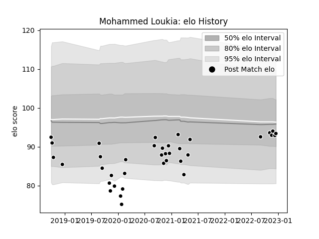

---  
layout: page  
title: Mohammed Loukia  
date: 2022-12-14 11:12:03.963703  
categories: player  
---
# Mohammed Loukia

## Positions: P

## Current elo: 93.0

## Current Percentile: 42.0

# Elo History

# Match History

| Team           |   Appearances |   Win Rate |
|:---------------|--------------:|-----------:|
| Provence Rugby |            36 |   0.527778 |

| Opponent                   |   Matches |   Win Rate |
|:---------------------------|----------:|-----------:|
| Mont-de-Marsan             |         5 |   0.4      |
| Beziers                    |         4 |   0.5      |
| Aurillac                   |         3 |   0.333333 |
| Biarritz Olympique         |         3 |   0.166667 |
| Carcassonne                |         3 |   0.666667 |
| Nevers                     |         3 |   0.333333 |
| Rouen                      |         3 |   0.833333 |
| Soyaux-Angouleme           |         3 |   0.333333 |
| Montauban                  |         2 |   1        |
| Roval Drome XV             |         2 |   1        |
| Vannes                     |         2 |   0.5      |
| Oyonnax                    |         1 |   0        |
| Perpignan                  |         1 |   1        |
| Valence Romans Drome Rugby |         1 |   1        |