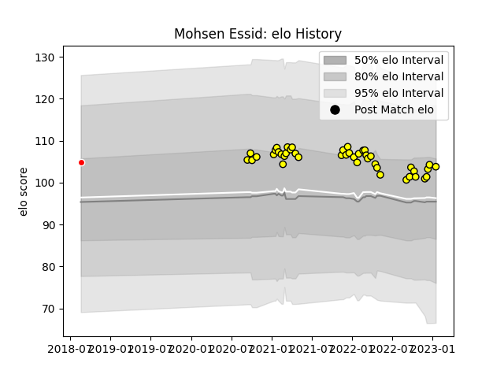

---  
layout: page  
title: Mohsen Essid  
date: 2022-12-14 11:19:50.503843  
categories: player  
---
# Mohsen Essid

## Positions: L, FL

## Country: Tunisia

## Current elo: 103.0

## Current Percentile: 74.0

# Elo History

# Match History

| Team    |   Appearances |   Win Rate |
|:--------|--------------:|-----------:|
| Albi    |            32 |   0.703125 |
| Tunisia |             1 |   1        |

| Opponent                   |   Matches |   Win Rate |
|:---------------------------|----------:|-----------:|
| Bourgoin-Jallieu           |         5 |   0.8      |
| Cognac Saint Jean d'Angély |         4 |   0.75     |
| Nice                       |         3 |   0.5      |
| US Bressane                |         3 |   0.666667 |
| Aubenas                    |         2 |   1        |
| Blagnac                    |         2 |   0.5      |
| Dijon                      |         2 |   1        |
| Narbonne                   |         2 |   1        |
| Suresnes                   |         2 |   0.5      |
| Tarbes                     |         2 |   0.5      |
| Carqueiranne-Hyères        |         1 |   0        |
| Chambery                   |         1 |   1        |
| Dax                        |         1 |   1        |
| Morocco                    |         1 |   1        |
| Soyaux-Angouleme           |         1 |   0        |
| Valence Romans Drome Rugby |         1 |   1        |