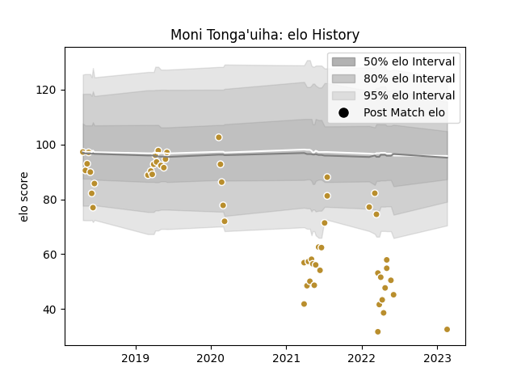

---  
layout: page  
title: Moni Tonga'uiha  
date: 2023-02-24 02:32:27.759569  
categories: player  
---
# Moni Tonga'uiha

## Positions: FL, N8

## Current elo: 33.0

## Current Percentile: 0.0

# Elo History

# Match History

| Team      |   Appearances |   Win Rate |
|:----------|--------------:|-----------:|
| NOLA Gold |            54 |   0.481481 |

| Opponent               |   Matches |   Win Rate |
|:-----------------------|----------:|-----------:|
| Houston SaberCats      |         5 |   0.8      |
| New England Free Jacks |         5 |   0.4      |
| R.U. New York          |         5 |   0.4      |
| Rugby ATL              |         5 |   0        |
| San Diego Legion       |         5 |   0        |
| Rugby New York         |         4 |   0.5      |
| Seattle Seawolves      |         4 |   0.25     |
| Toronto Arrows         |         4 |   0.75     |
| Utah Warriors          |         4 |   1        |
| Austin Elite Rugby     |         3 |   0.666667 |
| Old Glory DC           |         3 |   1        |
| Austin Gilgronis       |         2 |   0        |
| Glendale Raptors       |         2 |   0        |
| Colorado Raptors       |         1 |   1        |
| Dallas Jackals         |         1 |   1        |
| L. A. Giltinis         |         1 |   1        |