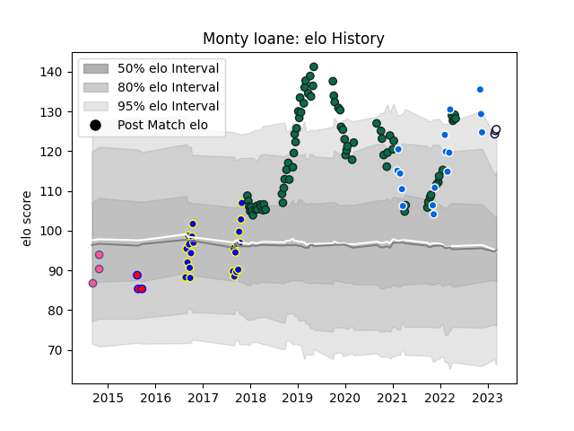

---  
layout: page  
title: Monty Ioane  
date: 2023-03-02 11:27:41.956813  
categories: player  
---
# Monty Ioane

## Positions: W

## Country: Italy

## Current elo: 124.0

## Current Percentile: 95.0

# Elo History

# Match History

| Team                 |   Appearances |   Win Rate |
|:---------------------|--------------:|-----------:|
| Benetton Treviso     |            76 |   0.421053 |
| Bay of Plenty        |            22 |   0.409091 |
| Italy                |            16 |   0.25     |
| Stade Francais Paris |             3 |   0.666667 |
| Tasman               |             3 |   0.666667 |
| Melbourne Rebels     |             1 |   0        |

| Opponent             |   Matches |   Win Rate |
|:---------------------|----------:|-----------:|
| Zebre                |        10 |   0.7      |
| Scarlets             |         8 |   0.25     |
| Leinster             |         6 |   0.25     |
| Cardiff Blues        |         5 |   0.2      |
| Dragons              |         5 |   1        |
| Connacht             |         4 |   0        |
| Otago                |         4 |   0.5      |
| Ospreys              |         4 |   0        |
| Wellington           |         3 |   0        |
| Southern Kings       |         3 |   1        |
| Edinburgh            |         3 |   0.666667 |
| Agen                 |         3 |   0.666667 |
| Auckland             |         3 |   0        |
| Lyon                 |         2 |   0.5      |
| Southland            |         2 |   0.5      |
| Northland            |         2 |   0.5      |
| Northampton Saints   |         2 |   0        |
| Taranaki             |         2 |   0        |
| Toulon               |         2 |   0        |
| Munster              |         2 |   0        |
| Ulster               |         2 |   0.25     |
| Manawatu             |         2 |   1        |
| Scotland             |         2 |   0        |
| Waikato              |         2 |   1        |
| Ireland              |         2 |   0        |
| Hawke's Bay          |         2 |   1        |
| Harlequins           |         2 |   0.5      |
| Wales                |         2 |   0.5      |
| Glasgow Warriors     |         2 |   0.5      |
| France               |         2 |   0        |
| England              |         2 |   0        |
| Cheetahs             |         2 |   0.5      |
| Stade Francais Paris |         1 |   1        |
| Australia            |         1 |   1        |
| Counties Manukau     |         1 |   0        |
| Stormers             |         1 |   1        |
| Uruguay              |         1 |   1        |
| Western Force        |         1 |   0        |
| South Africa         |         1 |   0        |
| Bucarest Wolves      |         1 |   1        |
| Bath Rugby           |         1 |   0        |
| Samoa                |         1 |   1        |
| Perpignan            |         1 |   1        |
| Oyonnax              |         1 |   0        |
| Bay of Plenty        |         1 |   1        |
| North Harbour        |         1 |   0        |
| New Zealand          |         1 |   0        |
| Argentina            |         1 |   0        |
| Lions                |         1 |   0        |
| Bucuresti            |         1 |   1        |
| Grenoble             |         1 |   1        |
| Gloucester Rugby     |         1 |   0        |
| Bulls                |         1 |   0        |
| Montpellier Herault  |         1 |   0        |