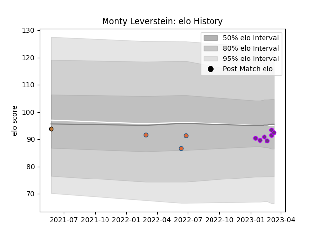

---  
layout: page  
title: Monty Leverstein  
date: 2023-02-02 19:00:46.857990  
categories: player  
---
# Monty Leverstein

## Positions: L

## Country: Netherlands

## Current elo: 90.0

## Current Percentile: 38.0

# Elo History

# Match History

| Team        |   Appearances |   Win Rate |
|:------------|--------------:|-----------:|
| Netherlands |             3 |          0 |
| US Bressane |             2 |          0 |
| Narbonne    |             1 |          0 |

| Opponent    |   Matches |   Win Rate |
|:------------|----------:|-----------:|
| Blagnac     |         1 |          0 |
| Chambery    |         1 |          0 |
| Italy       |         1 |          0 |
| Portugal    |         1 |          0 |
| US Bressane |         1 |          0 |
| Zimbabwe    |         1 |          0 |