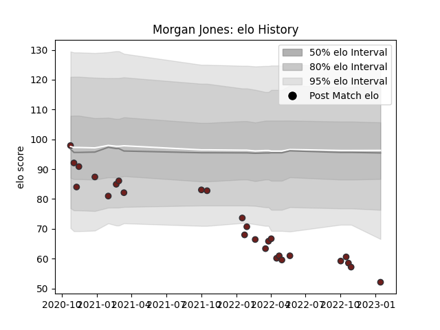

---  
layout: page  
title: Morgan Jones  
date: 2023-01-15 11:44:00.581067  
categories: player  
---
# Morgan Jones

## Positions: L

## Current elo: 52.0

## Current Percentile: 2.0

# Elo History

# Match History

| Team     |   Appearances |   Win Rate |
|:---------|--------------:|-----------:|
| Scarlets |            27 |   0.444444 |

| Opponent         |   Matches |   Win Rate |
|:-----------------|----------:|-----------:|
| Benetton Treviso |         3 |   0.666667 |
| Connacht         |         3 |   0.333333 |
| Leinster         |         3 |   0        |
| Zebre            |         3 |   1        |
| Dragons          |         2 |   0.5      |
| Edinburgh        |         2 |   0.5      |
| Ospreys          |         2 |   0.5      |
| Bordeaux Begles  |         1 |   0        |
| Bristol Rugby    |         1 |   0        |
| Bulls            |         1 |   0        |
| Cardiff Blues    |         1 |   1        |
| Cheetahs         |         1 |   1        |
| Lions            |         1 |   1        |
| Munster          |         1 |   0        |
| Stormers         |         1 |   0        |
| Ulster           |         1 |   0        |