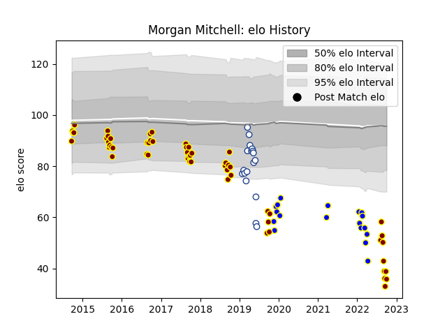

---  
layout: page  
title: Morgan Mitchell  
date: 2023-03-21 18:15:14.207203  
categories: player  
---
# Morgan Mitchell

Last updated: 2023-03-21
## Positions: P

## Current elo: 36.0

## Current Percentile: 0.0

# Elo History

# Match History

| Team              |   Appearances |   Win Rate |
|:------------------|--------------:|-----------:|
| Southland         |            56 |   0.142857 |
| Kamaishi Seawaves |            18 |   0.361111 |
| Toronto Arrows    |            18 |   0.611111 |

| Opponent                         |   Matches |   Win Rate |
|:---------------------------------|----------:|-----------:|
| Manawatu                         |         7 |   0.142857 |
| Bay of Plenty                    |         6 |   0.166667 |
| Auckland                         |         5 |   0.1      |
| Hawke's Bay                      |         5 |   0.1      |
| Otago                            |         5 |   0        |
| Northland                        |         5 |   0.4      |
| Tasman                           |         4 |   0        |
| Counties Manukau                 |         4 |   0.5      |
| North Harbour                    |         4 |   0        |
| Waikato                          |         3 |   0        |
| Skyactivs Hiroshima              |         3 |   0.666667 |
| Seattle Seawolves                |         3 |   0.333333 |
| Wellington                       |         3 |   0        |
| Canterbury                       |         3 |   0.333333 |
| Hanazono Kintetsu Liners         |         3 |   0        |
| San Diego Legion                 |         2 |   1        |
| Mie Honda Heat                   |         2 |   0        |
| Austin Elite Rugby               |         2 |   1        |
| NOLA Gold                        |         2 |   0        |
| Kurita Water Gush                |         2 |   1        |
| Hino Red Dolphins                |         2 |   0        |
| R.U. New York                    |         2 |   0.5      |
| Rugby New York                   |         2 |   0.5      |
| Utah Warriors                    |         2 |   1        |
| Glendale Raptors                 |         2 |   0.5      |
| Taranaki                         |         2 |   0        |
| Coca-Cola Red Sparks             |         1 |   0.5      |
| Toyota Industries Shuttles Aichi |         1 |   0        |
| Kyuden Voltex                    |         1 |   0        |
| Shimizu Blue Sharks              |         1 |   1        |
| Mazda Blue Zoomers               |         1 |   1        |
| Houston SaberCats                |         1 |   1        |
| Mitsubishi Dynaboars             |         1 |   0        |