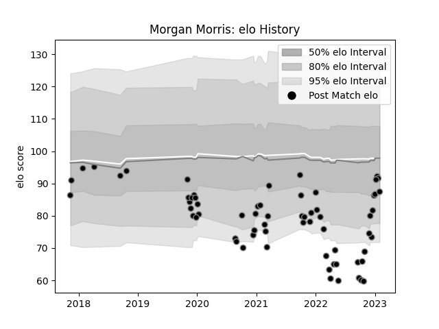

---  
layout: page  
title: Morgan Morris  
date: 2022-12-14 11:36:47.492775  
categories: player  
---
# Morgan Morris

## Positions: N8, FL

## Current elo: 82.0

## Current Percentile: 15.0

# Elo History

# Match History

| Team    |   Appearances |   Win Rate |
|:--------|--------------:|-----------:|
| Ospreys |            57 |   0.342105 |

| Opponent           |   Matches |   Win Rate |
|:-------------------|----------:|-----------:|
| Dragons            |         7 |   0.5      |
| Cardiff Blues      |         5 |   0.6      |
| Connacht           |         5 |   0.4      |
| Scarlets           |         5 |   0.3      |
| Ulster             |         4 |   0.25     |
| Munster            |         3 |   0.333333 |
| Lions              |         2 |   0        |
| Bulls              |         2 |   0        |
| Stormers           |         2 |   0.25     |
| Sharks             |         2 |   0        |
| Saracens           |         2 |   0        |
| Racing 92          |         2 |   0        |
| Zebre              |         2 |   1        |
| Leinster           |         2 |   0.5      |
| Glasgow Warriors   |         2 |   0        |
| Edinburgh          |         2 |   1        |
| Leicester Tigers   |         1 |   0        |
| Gloucester Rugby   |         1 |   0        |
| Southern Kings     |         1 |   0        |
| Cheetahs           |         1 |   0        |
| Castres Olympique  |         1 |   1        |
| Wasps              |         1 |   0        |
| Worcester Warriors |         1 |   0        |
| Benetton Treviso   |         1 |   1        |