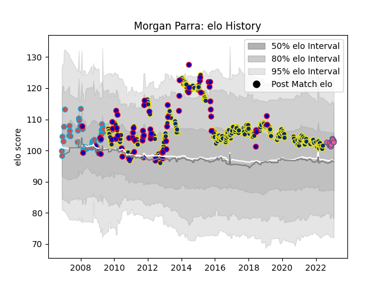

---  
layout: page  
title: Morgan Parra  
date: 2022-12-12 15:35:57.771167  
categories: player  
---
# Morgan Parra

## Positions: SH

## Country: France

## Current elo: 87.0

## Current Percentile: 13.0

# Elo History

# Match History

| Team                 |   Appearances |   Win Rate |
|:---------------------|--------------:|-----------:|
| Clermont Auvergne    |           286 |   0.66958  |
| France               |            61 |   0.47541  |
| Bourgoin-Jallieu     |            36 |   0.472222 |
| Stade Francais Paris |             5 |   0.5      |

| Opponent             |   Matches |   Win Rate |
|:---------------------|----------:|-----------:|
| Racing 92            |        25 |   0.48     |
| Toulon               |        23 |   0.565217 |
| Stade Toulousain     |        22 |   0.545455 |
| Stade Francais Paris |        22 |   0.590909 |
| Montpellier Herault  |        22 |   0.545455 |
| Brive                |        18 |   0.722222 |
| Castres Olympique    |        16 |   0.71875  |
| Bordeaux Begles      |        15 |   0.6      |
| Perpignan            |        14 |   0.535714 |
| Pau                  |        11 |   0.636364 |
| La Rochelle          |        11 |   0.681818 |
| Lyon                 |        10 |   0.65     |
| England              |         9 |   0.222222 |
| Agen                 |         9 |   0.777778 |
| Biarritz Olympique   |         9 |   0.777778 |
| Bayonne              |         9 |   0.611111 |
| Saracens             |         8 |   0.75     |
| Wales                |         8 |   0.5      |
| Ireland              |         8 |   0.5      |
| New Zealand          |         7 |   0        |
| Grenoble             |         7 |   0.857143 |
| Scotland             |         7 |   1        |
| Leinster             |         7 |   0.571429 |
| Ospreys              |         6 |   0.666667 |
| Northampton Saints   |         6 |   0.666667 |
| Italy                |         6 |   0.666667 |
| Exeter Chiefs        |         6 |   0.833333 |
| Ulster               |         6 |   0.5      |
| Leicester Tigers     |         5 |   0.6      |
| Montauban            |         4 |   0.5      |
| Harlequins           |         4 |   1        |
| Clermont Auvergne    |         4 |   0.25     |
| Albi                 |         3 |   0.666667 |
| Argentina            |         3 |   0.333333 |
| Oyonnax              |         3 |   0.833333 |
| Australia            |         3 |   0        |
| Samoa                |         2 |   1        |
| Arix Viadana         |         2 |   1        |
| South Africa         |         2 |   0        |
| Scarlets             |         2 |   1        |
| Tonga                |         2 |   0.5      |
| Canada               |         2 |   1        |
| Auch                 |         2 |   1        |
| Bath Rugby           |         2 |   1        |
| Munster              |         2 |   1        |
| Aironi               |         2 |   1        |
| Bourgoin-Jallieu     |         2 |   1        |
| Dax                  |         2 |   0.5      |
| Sale Sharks          |         1 |   1        |
| Romania              |         1 |   1        |
| Narbonne             |         1 |   1        |
| Mont-de-Marsan       |         1 |   1        |
| Timisoara Saracens   |         1 |   1        |
| London Irish         |         1 |   1        |
| Japan                |         1 |   1        |
| Worcester Warriors   |         1 |   1        |