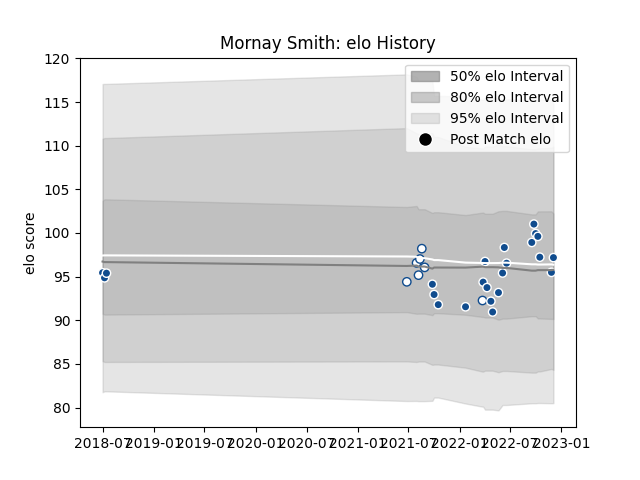

---  
layout: page  
title: Mornay Smith  
date: 2022-12-09 13:04:30.975856  
categories: player  
---
# Mornay Smith

## Positions: P

## Current elo: 97.0

## Current Percentile: 55.0

# Elo History

# Match History

| Team       |   Appearances |   Win Rate |
|:-----------|--------------:|-----------:|
| Bulls      |            23 |   0.565217 |
| Blue Bulls |             7 |   0.857143 |

| Opponent            |   Matches |   Win Rate |
|:--------------------|----------:|-----------:|
| Stormers            |         3 |        0   |
| Leinster            |         2 |        0.5 |
| Connacht            |         2 |        0.5 |
| Edinburgh           |         2 |        0.5 |
| Glasgow Warriors    |         2 |        0.5 |
| Pumas               |         2 |        1   |
| Ospreys             |         2 |        1   |
| Lions               |         2 |        0.5 |
| Natal Sharks        |         1 |        0   |
| Ulster              |         1 |        1   |
| Sunwolves           |         1 |        0   |
| Sharks              |         1 |        1   |
| Benetton Treviso    |         1 |        1   |
| Munster             |         1 |        0   |
| Cardiff Blues       |         1 |        1   |
| Jaguares            |         1 |        1   |
| Griquas             |         1 |        1   |
| Golden Lions        |         1 |        1   |
| Free State Cheetahs |         1 |        1   |
| Dragons             |         1 |        1   |
| Western Province    |         1 |        1   |