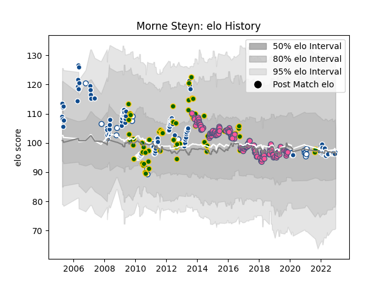

---  
layout: page  
title: Morne Steyn  
date: 2023-02-24 02:33:30.950938  
categories: player  
---
# Morne Steyn

## Positions: FH

## Country: South Africa

## Current elo: 97.0

## Current Percentile: 47.0

# Elo History

# Match History

| Team                 |   Appearances |   Win Rate |
|:---------------------|--------------:|-----------:|
| Stade Francais Paris |           148 |   0.47973  |
| Bulls                |           134 |   0.66791  |
| South Africa         |            67 |   0.656716 |
| Blue Bulls           |            21 |   0.690476 |

| Opponent                 |   Matches |   Win Rate |
|:-------------------------|----------:|-----------:|
| Sharks                   |        17 |   0.588235 |
| Australia                |        15 |   0.4      |
| Stormers                 |        14 |   0.428571 |
| New Zealand              |        13 |   0.307692 |
| Lions                    |        12 |   1        |
| Clermont Auvergne        |        12 |   0.416667 |
| Crusaders                |        11 |   0.454545 |
| Cheetahs                 |        10 |   1        |
| Toulon                   |        10 |   0.6      |
| Racing 92                |        10 |   0.4      |
| Queensland Reds          |         9 |   0.333333 |
| Bordeaux Begles          |         9 |   0.555556 |
| Pau                      |         9 |   0.555556 |
| Chiefs                   |         9 |   0.722222 |
| Argentina                |         8 |   0.8125   |
| Lyon                     |         8 |   0.125    |
| La Rochelle              |         8 |   0.4375   |
| Stade Toulousain         |         8 |   0.1875   |
| Highlanders              |         7 |   0.571429 |
| Montpellier Herault      |         7 |   0.428571 |
| Grenoble                 |         7 |   0.428571 |
| Brive                    |         7 |   0.571429 |
| New South Wales Waratahs |         7 |   0.857143 |
| Castres Olympique        |         7 |   0.571429 |
| Wales                    |         6 |   1        |
| Blues                    |         6 |   0.5      |
| Natal Sharks             |         6 |   0.333333 |
| Oyonnax                  |         6 |   0.5      |
| Brumbies                 |         6 |   0.5      |
| Free State Cheetahs      |         5 |   0.7      |
| Western Force            |         5 |   0.6      |
| Scotland                 |         4 |   0.75     |
| Italy                    |         4 |   1        |
| Ireland                  |         4 |   0.75     |
| Agen                     |         4 |   0.5      |
| Hurricanes               |         4 |   1        |
| Bayonne                  |         4 |   0.75     |
| Edinburgh                |         4 |   0.5      |
| Golden Lions             |         4 |   1        |
| England                  |         4 |   0.875    |
| Munster                  |         3 |   0.666667 |
| Western Province         |         3 |   1        |
| Benetton Treviso         |         3 |   1        |
| France                   |         3 |   0.666667 |
| Dragons                  |         3 |   0.333333 |
| Leicester Tigers         |         3 |   0.333333 |
| Glasgow Warriors         |         2 |   0.5      |
| Perpignan                |         2 |   1        |
| Wasps                    |         2 |   0        |
| Biarritz Olympique       |         2 |   1        |
| Southern Kings           |         2 |   1        |
| Bucuresti                |         2 |   1        |
| Melbourne Rebels         |         2 |   1        |
| Pumas                    |         2 |   0.5      |
| Samoa                    |         2 |   1        |
| Ospreys                  |         2 |   0.5      |
| Newcastle Falcons        |         2 |   0.5      |
| London Irish             |         2 |   0.5      |
| Harlequins               |         1 |   0        |
| Timisoara Saracens       |         1 |   1        |
| Jaguares                 |         1 |   0        |
| Bath Rugby               |         1 |   1        |
| Namibia                  |         1 |   1        |
| Griquas                  |         1 |   1        |
| United States of America |         1 |   1        |
| Ulster                   |         1 |   1        |
| Gloucester Rugby         |         1 |   1        |
| British and Irish Lions  |         1 |   1        |
| Fiji                     |         1 |   1        |
| Leinster                 |         1 |   1        |
| Bucarest Wolves          |         1 |   1        |
| Scarlets                 |         1 |   1        |
| Northampton Saints       |         1 |   0        |
| Cardiff Blues            |         1 |   1        |
| Cats                     |         1 |   1        |
| Worcester Warriors       |         1 |   0        |