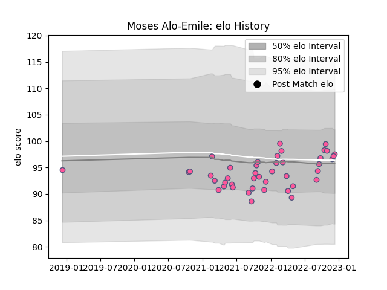

---  
layout: page  
title: Moses Alo-Emile  
date: 2022-12-14 11:31:09.051232  
categories: player  
---
# Moses Alo-Emile

## Positions: P

## Current elo: 98.0

## Current Percentile: 59.0

# Elo History

# Match History

| Team                 |   Appearances |   Win Rate |
|:---------------------|--------------:|-----------:|
| Stade Francais Paris |            43 |   0.488372 |

| Opponent            |   Matches |   Win Rate |
|:--------------------|----------:|-----------:|
| Clermont Auvergne   |         5 |   0.4      |
| Racing 92           |         5 |   0.2      |
| Pau                 |         4 |   0.75     |
| Lyon                |         4 |   0.5      |
| La Rochelle         |         3 |   0.666667 |
| Montpellier Herault |         3 |   0.333333 |
| Toulon              |         3 |   0.333333 |
| Castres Olympique   |         3 |   0.333333 |
| Bayonne             |         2 |   1        |
| Brive               |         2 |   0.5      |
| Bordeaux Begles     |         2 |   0        |
| Biarritz Olympique  |         2 |   0.5      |
| Ospreys             |         1 |   0        |
| Perpignan           |         1 |   1        |
| Benetton Treviso    |         1 |   1        |
| Stade Toulousain    |         1 |   1        |
| Agen                |         1 |   1        |