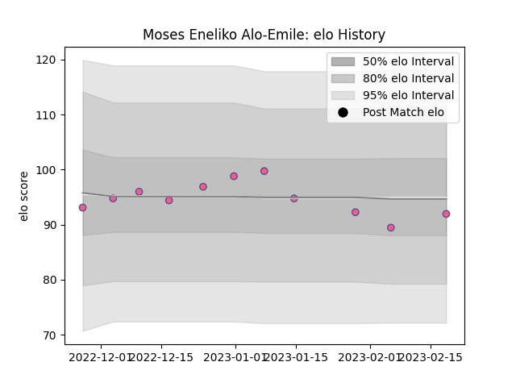

---  
layout: page  
title: Moses Eneliko Alo-Emile  
date: 2023-02-24 02:25:18.549887  
categories: player  
---
# Moses Eneliko Alo-Emile

## Positions: P

## Current elo: 92.0

## Current Percentile: 30.0

# Elo History

# Match History

| Team                 |   Appearances |   Win Rate |
|:---------------------|--------------:|-----------:|
| Stade Francais Paris |            11 |   0.636364 |

| Opponent          |   Matches |   Win Rate |
|:------------------|----------:|-----------:|
| Lions             |         2 |        0.5 |
| Bayonne           |         1 |        0   |
| Benetton Treviso  |         1 |        1   |
| Bordeaux Begles   |         1 |        1   |
| Castres Olympique |         1 |        1   |
| La Rochelle       |         1 |        1   |
| Pau               |         1 |        1   |
| Perpignan         |         1 |        0   |
| Racing 92         |         1 |        1   |
| Toulon            |         1 |        0   |