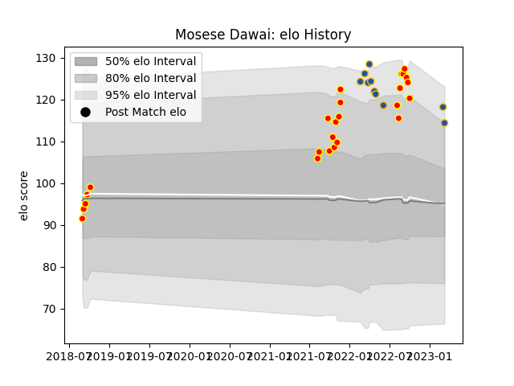

---  
layout: page  
title: Mosese Dawai  
date: 2023-03-04 11:41:24.994830  
categories: player  
---
# Mosese Dawai

## Positions: W

## Current elo: 120.0

## Current Percentile: 94.0

# Elo History

# Match History

| Team        |   Appearances |   Win Rate |
|:------------|--------------:|-----------:|
| Waikato     |            25 |       0.74 |
| Highlanders |             8 |       0.25 |

| Opponent         |   Matches |   Win Rate |
|:-----------------|----------:|-----------:|
| Hawke's Bay      |         3 |   0.5      |
| Bay of Plenty    |         3 |   1        |
| Tasman           |         3 |   1        |
| Northland        |         3 |   0.666667 |
| Wellington       |         3 |   0.666667 |
| Blues            |         3 |   0        |
| Otago            |         2 |   0.5      |
| Taranaki         |         2 |   0.5      |
| Auckland         |         2 |   0.5      |
| Chiefs           |         1 |   0        |
| Counties Manukau |         1 |   1        |
| Crusaders        |         1 |   0        |
| Fijian Drua      |         1 |   1        |
| Canterbury       |         1 |   1        |
| Manawatu         |         1 |   1        |
| Moana Pasifika   |         1 |   1        |
| North Harbour    |         1 |   1        |
| Brumbies         |         1 |   0        |