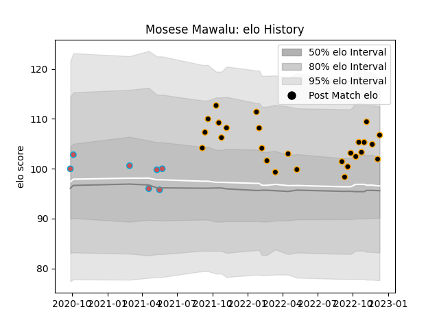

---  
layout: page  
title: Mosese Mawalu  
date: 2023-01-30 17:51:07.209220  
categories: player  
---
# Mosese Mawalu

## Positions: W

## Current elo: 110.0

## Current Percentile: 80.0

# Elo History

# Match History

| Team             |   Appearances |   Win Rate |
|:-----------------|--------------:|-----------:|
| Chambery         |            30 |       0.5  |
| Bourgoin-Jallieu |             8 |       0.25 |

| Opponent                   |   Matches |   Win Rate |
|:---------------------------|----------:|-----------:|
| Albi                       |         4 |   0        |
| Blagnac                    |         4 |   0.5      |
| Cognac Saint Jean d'Angély |         4 |   0.5      |
| Dax                        |         4 |   0.25     |
| Bourgoin-Jallieu           |         3 |   0.333333 |
| Tarbes                     |         3 |   0.666667 |
| Nice                       |         3 |   0.666667 |
| Narbonne                   |         2 |   0.5      |
| Suresnes                   |         2 |   1        |
| Valence Romans Drome Rugby |         2 |   0.5      |
| Aubenas                    |         1 |   1        |
| Rennes                     |         1 |   1        |
| Soyaux-Angouleme           |         1 |   1        |
| Chambery                   |         1 |   0        |
| Carqueiranne-Hyères        |         1 |   0        |
| US Bressane                |         1 |   0        |
| Massy                      |         1 |   0        |