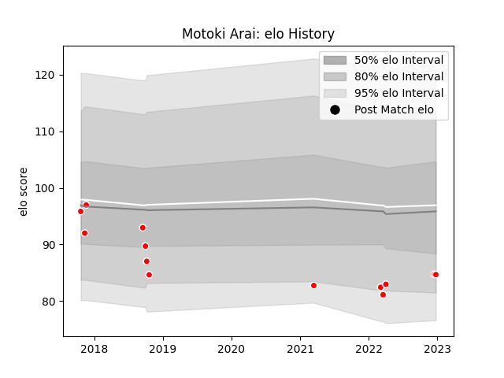

---  
layout: page  
title: Motoki Arai  
date: 2023-02-16 11:19:49.818000  
categories: player  
---
# Motoki Arai

## Positions: C, FB

## Current elo: 81.0

## Current Percentile: 23.0

# Elo History

# Match History

| Team                  |   Appearances |   Win Rate |
|:----------------------|--------------:|-----------:|
| Chugoku Red Regulions |            14 |   0.214286 |

| Opponent                         |   Matches |   Win Rate |
|:---------------------------------|----------:|-----------:|
| Kamaishi Seawaves                |         2 |        0   |
| Kurita Water Gush                |         2 |        0.5 |
| NTT Docomo Red Hurricanes Osaka  |         2 |        0   |
| Chubu Electric Power             |         1 |        1   |
| Hanazono Kintetsu Liners         |         1 |        0   |
| Kyuden Voltex                    |         1 |        0   |
| Mazda Blue Zoomers               |         1 |        0   |
| Mitsubishi Dynaboars             |         1 |        0   |
| Shimizu Blue Sharks              |         1 |        0   |
| Skyactivs Hiroshima              |         1 |        1   |
| Toyota Industries Shuttles Aichi |         1 |        0   |