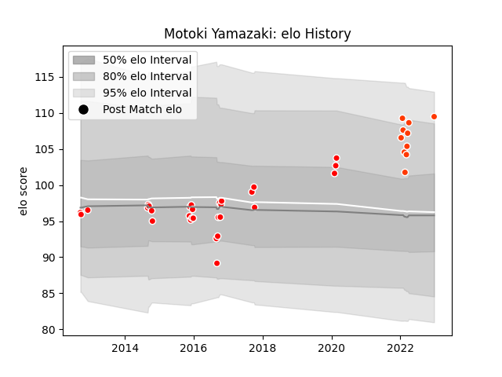

---  
layout: page  
title: Motoki Yamazaki  
date: 2022-12-28 12:56:02.275367  
categories: player  
---
# Motoki Yamazaki

## Positions: P

## Current elo: 110.0

## Current Percentile: 90.0

# Elo History

# Match History

| Team                  |   Appearances |   Win Rate |
|:----------------------|--------------:|-----------:|
| Kobelco Kobe Steelers |            29 |   0.827586 |
| Hino Red Dolphins     |            10 |   0.3      |

| Opponent                         |   Matches |   Win Rate |
|:---------------------------------|----------:|-----------:|
| Yokohama Canon Eagles            |         5 |   0.8      |
| Toyota Verblitz                  |         4 |   0.5      |
| Coca-Cola Red Sparks             |         3 |   1        |
| Hanazono Kintetsu Liners         |         3 |   0.333333 |
| Mie Honda Heat                   |         3 |   0.333333 |
| NTT Docomo Red Hurricanes Osaka  |         3 |   0.666667 |
| Toyota Industries Shuttles Aichi |         3 |   0.666667 |
| Black Rams Tokyo                 |         2 |   1        |
| Green Rockets Tokatsu            |         2 |   1        |
| Kamaishi Seawaves                |         2 |   1        |
| Mitsubishi Dynaboars             |         2 |   0        |
| Shizuoka Blue Revs               |         2 |   1        |
| Urayasu D-Rocks                  |         2 |   1        |
| Saitama Wild Knights             |         1 |   0        |
| Skyactivs Hiroshima              |         1 |   1        |
| Toshiba Brave Lupus Tokyo        |         1 |   1        |