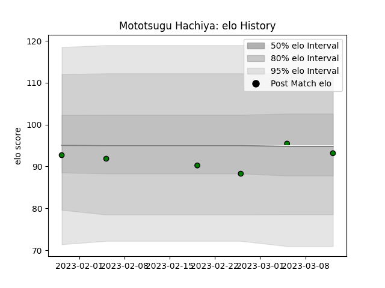

---  
layout: page  
title: Mototsugu Hachiya  
date: 2023-03-17 17:30:57.429903  
categories: player  
---
# Mototsugu Hachiya

## Positions: P

## Current elo: 93.0

## Current Percentile: 51.0

# Elo History

# Match History

| Team                 |   Appearances |   Win Rate |
|:---------------------|--------------:|-----------:|
| Mitsubishi Dynaboars |             6 |   0.166667 |

| Opponent                          |   Matches |   Win Rate |
|:----------------------------------|----------:|-----------:|
| Green Rockets Tokatsu             |         1 |          0 |
| Hanazono Kintetsu Liners          |         1 |          1 |
| Kobelco Kobe Steelers             |         1 |          0 |
| Kubota Spears Funabashi Tokyo-Bay |         1 |          0 |
| Tokyo Sungoliath                  |         1 |          0 |
| Yokohama Canon Eagles             |         1 |          0 |