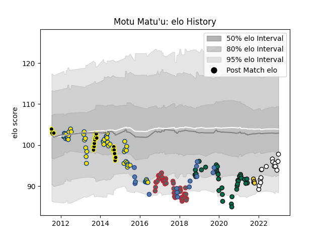

---  
layout: page  
title: Motu Matu'u  
date: 2022-12-09 13:19:15.482431  
categories: player  
---
# Motu Matu'u

## Positions: H

## Country: Samoa

## Current elo: 91.0

## Current Percentile: 32.0

# Elo History

# Match History

| Team             |   Appearances |   Win Rate |
|:-----------------|--------------:|-----------:|
| Hurricanes       |            53 |   0.622642 |
| Gloucester Rugby |            47 |   0.5      |
| London Irish     |            30 |   0.4      |
| Wellington       |            19 |   0.526316 |
| Samoa            |            15 |   0.366667 |
| Brive            |            14 |   0.321429 |
| La Rochelle      |             4 |   0.75     |

| Opponent                 |   Matches |   Win Rate |
|:-------------------------|----------:|-----------:|
| Highlanders              |         7 |   0.571429 |
| Blues                    |         7 |   0.714286 |
| Leicester Tigers         |         6 |   0.5      |
| Bath Rugby               |         6 |   0.25     |
| Northampton Saints       |         6 |   0.166667 |
| Crusaders                |         6 |   0.666667 |
| Newcastle Falcons        |         6 |   0.333333 |
| Worcester Warriors       |         5 |   0.4      |
| Harlequins               |         5 |   0.3      |
| Sale Sharks              |         4 |   0.25     |
| Chiefs                   |         4 |   0.5      |
| La Rochelle              |         4 |   0.5      |
| Sharks                   |         4 |   0.5      |
| Exeter Chiefs            |         4 |   0.375    |
| Stormers                 |         4 |   0.25     |
| New South Wales Waratahs |         4 |   0.5      |
| Queensland Reds          |         4 |   0.75     |
| Wasps                    |         4 |   0.375    |
| Toulon                   |         3 |   0.333333 |
| Montpellier Herault      |         3 |   0.166667 |
| Saracens                 |         3 |   0.333333 |
| Melbourne Rebels         |         3 |   1        |
| Canterbury               |         3 |   0.333333 |
| Pau                      |         3 |   0        |
| Auckland                 |         3 |   0.333333 |
| Gloucester Rugby         |         3 |   0.666667 |
| North Harbour            |         2 |   1        |
| Lions                    |         2 |   1        |
| Racing 92                |         2 |   0        |
| Western Force            |         2 |   1        |
| Scotland                 |         2 |   0        |
| Hawke's Bay              |         2 |   0        |
| Germany                  |         2 |   1        |
| Biarritz Olympique       |         2 |   1        |
| Cheetahs                 |         2 |   0.5      |
| Georgia                  |         2 |   0.25     |
| Bordeaux Begles          |         2 |   0        |
| Bristol Rugby            |         2 |   0.75     |
| Northland                |         2 |   0.5      |
| Stade Toulousain         |         2 |   0        |
| United States of America |         2 |   0.5      |
| Brumbies                 |         2 |   0        |
| Taranaki                 |         2 |   1        |
| Cardiff Blues            |         2 |   0.5      |
| Counties Manukau         |         2 |   0.5      |
| Agen                     |         1 |   1        |
| Scarlets                 |         1 |   0        |
| Russia                   |         1 |   1        |
| Southern Kings           |         1 |   1        |
| Spain                    |         1 |   1        |
| Tasman                   |         1 |   0        |
| Waikato                  |         1 |   1        |
| Yorkshire Carnegie       |         1 |   1        |
| South Africa             |         1 |   0        |
| Japan                    |         1 |   0        |
| Romania                  |         1 |   0        |
| Perpignan                |         1 |   1        |
| Australia                |         1 |   0        |
| Bay of Plenty            |         1 |   1        |
| Bayonne                  |         1 |   1        |
| Bedford                  |         1 |   1        |
| Benetton Treviso         |         1 |   1        |
| Brive                    |         1 |   1        |
| Castres Olympique        |         1 |   1        |
| Clermont Auvergne        |         1 |   1        |
| Connacht                 |         1 |   1        |
| Cornish Pirates          |         1 |   1        |
| Doncaster                |         1 |   1        |
| Dragons                  |         1 |   1        |
| Ealing Trailfinders      |         1 |   1        |
| England                  |         1 |   0        |
| Hartpury College         |         1 |   1        |
| Jaguares                 |         1 |   1        |
| London Irish             |         1 |   1        |
| Zebre                    |         1 |   1        |