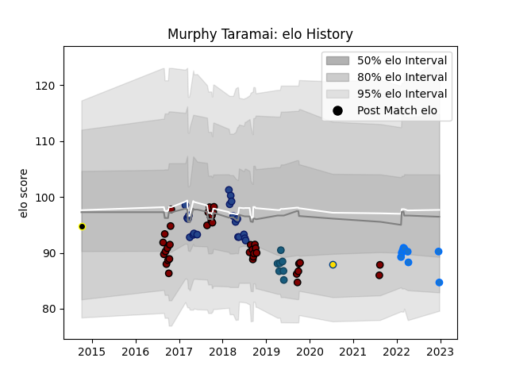

---  
layout: page  
title: Murphy Taramai  
date: 2022-12-28 12:58:16.703413  
categories: player  
---
# Murphy Taramai

## Positions: N8, FL

## Current elo: 85.0

## Current Percentile: 27.0

# Elo History

# Match History

| Team                |   Appearances |   Win Rate |
|:--------------------|--------------:|-----------:|
| North Harbour       |            37 |   0.608108 |
| Blues               |            20 |   0.45     |
| Shimizu Blue Sharks |             9 |   0.444444 |
| Glendale Raptors    |             7 |   0.428571 |
| Hurricanes          |             1 |   1        |
| Wellington          |             1 |   0        |

| Opponent                         |   Matches |   Win Rate |
|:---------------------------------|----------:|-----------:|
| Canterbury                       |         5 |   0        |
| Wellington                       |         4 |   0.5      |
| Waikato                          |         4 |   0.5      |
| Highlanders                      |         4 |   0.25     |
| Toyota Industries Shuttles Aichi |         3 |   0        |
| Tasman                           |         3 |   0.166667 |
| Counties Manukau                 |         3 |   1        |
| Crusaders                        |         3 |   0        |
| Taranaki                         |         3 |   0.666667 |
| Otago                            |         3 |   0.333333 |
| Northland                        |         3 |   1        |
| Auckland                         |         2 |   0.5      |
| Munakata Sanix Blues             |         2 |   0.5      |
| Southland                        |         2 |   1        |
| Queensland Reds                  |         2 |   1        |
| Bay of Plenty                    |         2 |   1        |
| New South Wales Waratahs         |         2 |   1        |
| Houston SaberCats                |         2 |   0.5      |
| Hawke's Bay                      |         2 |   1        |
| Hurricanes                       |         2 |   0        |
| Manawatu                         |         2 |   1        |
| Brumbies                         |         1 |   1        |
| Bulls                            |         1 |   1        |
| Utah Warriors                    |         1 |   1        |
| Urayasu D-Rocks                  |         1 |   0        |
| Chiefs                           |         1 |   0        |
| Toronto Arrows                   |         1 |   0        |
| Chugoku Red Regulions            |         1 |   1        |
| Melbourne Rebels                 |         1 |   1        |
| Stormers                         |         1 |   0        |
| Sharks                           |         1 |   0        |
| Seattle Seawolves                |         1 |   0        |
| San Diego Legion                 |         1 |   0        |
| R.U. New York                    |         1 |   1        |
| Kurita Water Gush                |         1 |   1        |
| Kyuden Voltex                    |         1 |   1        |
| Lions                            |         1 |   1        |
| Western Force                    |         1 |   1        |