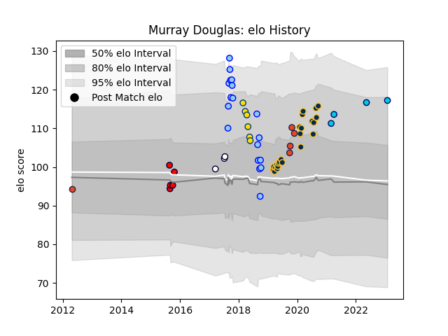

---  
layout: page  
title: Murray Douglas  
date: 2023-03-21 18:40:05.898952  
categories: player  
---
# Murray Douglas

Last updated: 2023-03-21
## Positions: L, FL

## Current elo: 113.0

## Current Percentile: None

# Elo History

# Match History

| Team               |   Appearances |   Win Rate |
|:-------------------|--------------:|-----------:|
| Brumbies           |            23 |   0.73913  |
| Northland          |            18 |   0.5      |
| Edinburgh          |             6 |   0.583333 |
| Hurricanes         |             6 |   0.666667 |
| Melbourne Rising   |             5 |   0.4      |
| Shizuoka Blue Revs |             4 |   0.25     |
| Melbourne Rebels   |             3 |   0        |

| Opponent                          |   Matches |   Win Rate |
|:----------------------------------|----------:|-----------:|
| Queensland Reds                   |         5 |   0.8      |
| New South Wales Waratahs          |         4 |   1        |
| Melbourne Rebels                  |         3 |   0.666667 |
| Western Force                     |         3 |   0.666667 |
| Sunwolves                         |         3 |   1        |
| Chiefs                            |         3 |   0.666667 |
| Jaguares                          |         3 |   0        |
| Highlanders                       |         2 |   0.5      |
| Wellington                        |         2 |   0        |
| Waikato                           |         2 |   0.5      |
| Southland                         |         2 |   1        |
| North Harbour                     |         2 |   0        |
| Manawatu                          |         2 |   0.5      |
| Auckland                          |         2 |   0        |
| Hawke's Bay                       |         2 |   0.5      |
| Cardiff Blues                     |         2 |   0.5      |
| Bulls                             |         2 |   0.5      |
| Canberra Vikings                  |         2 |   0        |
| Crusaders                         |         2 |   0        |
| Bay of Plenty                     |         1 |   1        |
| Stormers                          |         1 |   1        |
| Black Rams Tokyo                  |         1 |   0        |
| Blues                             |         1 |   1        |
| Bordeaux Begles                   |         1 |   0.5      |
| Toshiba Brave Lupus Tokyo         |         1 |   0        |
| Taranaki                          |         1 |   1        |
| Brisbane City                     |         1 |   0        |
| Leinster                          |         1 |   0        |
| NTT Docomo Red Hurricanes Osaka   |         1 |   1        |
| Scarlets                          |         1 |   1        |
| Kubota Spears Funabashi Tokyo-Bay |         1 |   0        |
| Queensland Country                |         1 |   1        |
| Otago                             |         1 |   1        |
| North Harbour Rays                |         1 |   1        |
| Counties Manukau                  |         1 |   1        |
| Zebre                             |         1 |   1        |