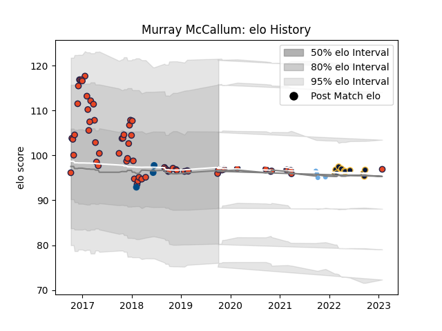

---  
layout: page  
title: Murray McCallum  
date: 2023-01-30 11:43:48.353142  
categories: player  
---
# Murray McCallum

## Positions: P

## Country: Scotland

## Current elo: 97.0

## Current Percentile: 51.0

# Elo History

# Match History

| Team               |   Appearances |   Win Rate |
|:-------------------|--------------:|-----------:|
| Edinburgh          |            66 |   0.5      |
| Worcester Warriors |            11 |   0.363636 |
| Glasgow Warriors   |             4 |   0.75     |
| Scotland           |             3 |   0.333333 |

| Opponent                 |   Matches |   Win Rate |
|:-------------------------|----------:|-----------:|
| Dragons                  |         7 |   0.571429 |
| Scarlets                 |         6 |   0.666667 |
| Benetton Treviso         |         5 |   0.6      |
| Ulster                   |         5 |   0.4      |
| Glasgow Warriors         |         4 |   0.5      |
| Stade Francais Paris     |         4 |   0.5      |
| Ospreys                  |         4 |   0.25     |
| Cardiff Blues            |         4 |   0.25     |
| Munster                  |         4 |   0.25     |
| Leinster                 |         4 |   0.25     |
| Southern Kings           |         3 |   0.666667 |
| Zebre                    |         3 |   0.666667 |
| Connacht                 |         3 |   0.333333 |
| Sharks                   |         2 |   0.5      |
| Krasny Yar               |         2 |   1        |
| Exeter Chiefs            |         2 |   0.5      |
| Timisoara Saracens       |         2 |   1        |
| London Irish             |         2 |   0.5      |
| Cheetahs                 |         2 |   0.5      |
| Newcastle Falcons        |         2 |   0.5      |
| Harlequins               |         2 |   0.5      |
| United States of America |         1 |   0        |
| Wales                    |         1 |   0        |
| Wasps                    |         1 |   0        |
| Agen                     |         1 |   1        |
| Saracens                 |         1 |   0        |
| Sale Sharks              |         1 |   0        |
| Bath Rugby               |         1 |   1        |
| La Rochelle              |         1 |   0        |
| Canada                   |         1 |   1        |
| Bristol Rugby            |         1 |   1        |
| Bordeaux Begles          |         1 |   0        |
| Lions                    |         1 |   1        |