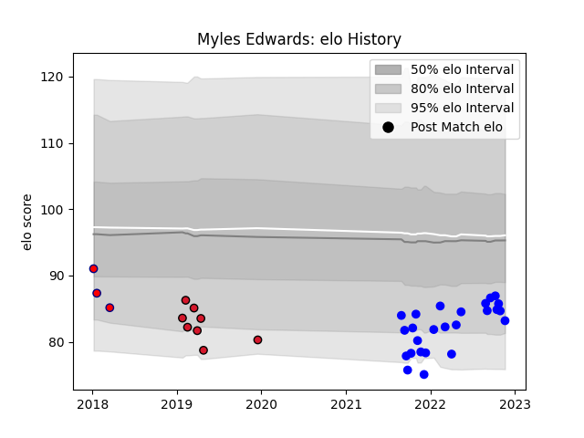

---  
layout: page  
title: Myles Edwards  
date: 2022-11-22 11:29:52.113973  
categories: player  
---
# Myles Edwards

## Positions: L

## Current elo: 83.0

## Current Percentile: 17.0

# Elo History

# Match History

| Team     |   Appearances |   Win Rate |
|:---------|--------------:|-----------:|
| Vannes   |            25 |       0.42 |
| Oyonnax  |             8 |       0.25 |
| Aurillac |             3 |       0    |

| Opponent           |   Matches |   Win Rate |
|:-------------------|----------:|-----------:|
| Bayonne            |         3 |   0        |
| Biarritz Olympique |         3 |   0.333333 |
| Aurillac           |         3 |   0.333333 |
| Oyonnax            |         3 |   0        |
| Agen               |         2 |   0.5      |
| Provence Rugby     |         2 |   0.5      |
| Carcassonne        |         2 |   0.5      |
| Grenoble           |         2 |   1        |
| Rouen              |         2 |   0        |
| Mont-de-Marsan     |         2 |   0.5      |
| Narbonne           |         2 |   0.75     |
| Nevers             |         2 |   0        |
| US Bressane        |         1 |   1        |
| Soyaux-Angouleme   |         1 |   0        |
| Montauban          |         1 |   0        |
| Perpignan          |         1 |   0        |
| Massy              |         1 |   1        |
| Brive              |         1 |   0        |
| Beziers            |         1 |   1        |
| Vannes             |         1 |   0        |