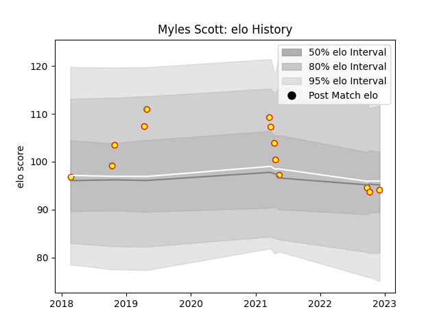

---  
layout: page  
title: Myles Scott  
date: 2022-12-12 15:38:28.506214  
categories: player  
---
# Myles Scott

## Positions: L, N8

## Current elo: 94.0

## Current Percentile: 46.0

# Elo History

# Match History

| Team     |   Appearances |   Win Rate |
|:---------|--------------:|-----------:|
| Richmond |            13 |   0.153846 |

| Opponent            |   Matches |   Win Rate |
|:--------------------|----------:|-----------:|
| Jersey              |         3 |   0.333333 |
| Bedford             |         2 |   0        |
| Doncaster           |         2 |   0        |
| Ealing Trailfinders |         2 |   0        |
| London Scottish     |         1 |   1        |
| Nottingham          |         1 |   0        |
| Saracens            |         1 |   0        |
| Yorkshire Carnegie  |         1 |   0        |