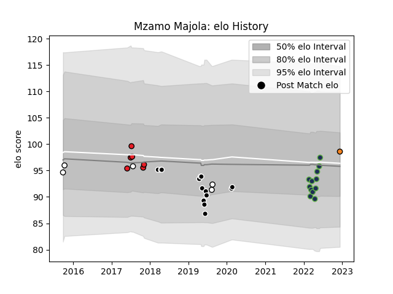

---  
layout: page  
title: Mzamo Majola  
date: 2023-02-26 11:19:51.913456  
categories: player  
---
# Mzamo Majola

## Positions: P

## Current elo: 108.0

## Current Percentile: 71.0

# Elo History

# Match History

| Team              |   Appearances |   Win Rate |
|:------------------|--------------:|-----------:|
| Seattle Seawolves |            19 |   0.473684 |
| Natal Sharks      |            18 |   0.583333 |
| Sharks            |            14 |   0.392857 |
| Southern Kings    |             6 |   0.333333 |

| Opponent                 |   Matches |   Win Rate |
|:-------------------------|----------:|-----------:|
| Free State Cheetahs      |         5 |   0.7      |
| Blue Bulls               |         4 |   0.5      |
| Jaguares                 |         3 |   0.333333 |
| San Diego Legion         |         3 |   1        |
| Golden Lions             |         3 |   0.666667 |
| Griquas                  |         3 |   0.333333 |
| Houston SaberCats        |         3 |   0.666667 |
| Hurricanes               |         2 |   0        |
| Stormers                 |         2 |   1        |
| Rugby New York           |         2 |   0        |
| R.U. New York            |         2 |   0        |
| Lions                    |         2 |   0.5      |
| L. A. Giltinis           |         2 |   0.5      |
| Austin Gilgronis         |         2 |   0        |
| Dallas Jackals           |         2 |   1        |
| Bulls                    |         2 |   0.5      |
| Brumbies                 |         2 |   0        |
| Western Province         |         2 |   1        |
| Glasgow Warriors         |         1 |   0        |
| Crusaders                |         1 |   0.5      |
| Melbourne Rebels         |         1 |   1        |
| NOLA Gold                |         1 |   0        |
| New England Free Jacks   |         1 |   0        |
| New South Wales Waratahs |         1 |   1        |
| Pumas                    |         1 |   0        |
| Chiefs                   |         1 |   0        |
| Cheetahs                 |         1 |   0        |
| Ulster                   |         1 |   0        |
| Utah Warriors            |         1 |   1        |