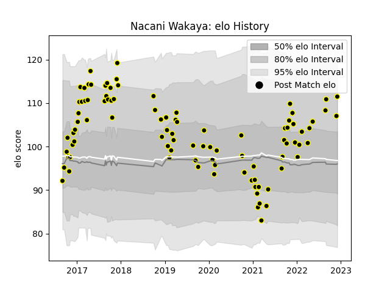

---  
layout: page  
title: Nacani Wakaya  
date: 2023-01-13 11:27:48.233543  
categories: player  
---
# Nacani Wakaya

## Positions: C, W

## Current elo: 129.0

## Current Percentile: 95.0

# Elo History

# Match History

| Team           |   Appearances |   Win Rate |
|:---------------|--------------:|-----------:|
| Mont-de-Marsan |           136 |   0.610294 |

| Opponent                   |   Matches |   Win Rate |
|:---------------------------|----------:|-----------:|
| Carcassonne                |        12 |   0.666667 |
| Beziers                    |        12 |   0.75     |
| Aurillac                   |        11 |   0.909091 |
| Montauban                  |         9 |   0.444444 |
| Colomiers                  |         8 |   0.375    |
| Vannes                     |         8 |   0.625    |
| Biarritz Olympique         |         8 |   0.3125   |
| Soyaux-Angouleme           |         7 |   0.428571 |
| Oyonnax                    |         7 |   0.357143 |
| Nevers                     |         6 |   0.666667 |
| Perpignan                  |         5 |   0.4      |
| Rouen                      |         5 |   1        |
| Grenoble                   |         5 |   0.4      |
| Provence Rugby             |         5 |   0.4      |
| Bayonne                    |         5 |   0.9      |
| Narbonne                   |         5 |   0.8      |
| US Bressane                |         3 |   0.666667 |
| Massy                      |         3 |   0.666667 |
| Dax                        |         3 |   0.666667 |
| Albi                       |         2 |   1        |
| Brive                      |         2 |   0.5      |
| Valence Romans Drome Rugby |         2 |   0.75     |
| Agen                       |         2 |   0.5      |
| Bourgoin-Jallieu           |         1 |   1        |