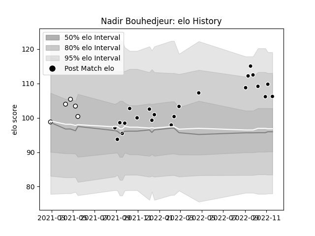

---  
layout: page  
title: Nadir Bouhedjeur  
date: 2022-12-12 14:57:13.166295  
categories: player  
---
# Nadir Bouhedjeur

## Positions: W, FB

## Current elo: 109.0

## Current Percentile: 82.0

# Elo History

# Match History

| Team                       |   Appearances |   Win Rate |
|:---------------------------|--------------:|-----------:|
| Provence Rugby             |            23 |   0.456522 |
| Valence Romans Drome Rugby |             5 |   0.4      |

| Opponent         |   Matches |   Win Rate |
|:-----------------|----------:|-----------:|
| Carcassonne      |         3 |   1        |
| Montauban        |         3 |   0.666667 |
| Nevers           |         3 |   0.666667 |
| Oyonnax          |         3 |   0.166667 |
| Agen             |         2 |   0.5      |
| Aurillac         |         2 |   0        |
| Beziers          |         2 |   1        |
| Colomiers        |         2 |   0        |
| Mont-de-Marsan   |         2 |   0.5      |
| Narbonne         |         2 |   0        |
| Massy            |         1 |   0        |
| Perpignan        |         1 |   0        |
| Rouen            |         1 |   0        |
| Soyaux-Angouleme |         1 |   1        |