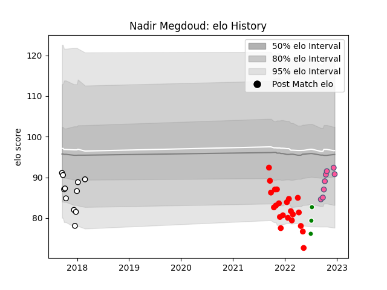

---  
layout: page  
title: Nadir Megdoud  
date: 2023-01-15 11:45:13.888054  
categories: player  
---
# Nadir Megdoud

## Positions: W

## Country: Algeria

## Current elo: 97.0

## Current Percentile: 56.0

# Elo History

# Match History

| Team                 |   Appearances |   Win Rate |
|:---------------------|--------------:|-----------:|
| Rouen                |            23 |   0.369565 |
| Brive                |            11 |   0.272727 |
| Stade Francais Paris |             9 |   0.555556 |
| Algeria              |             3 |   0.666667 |

| Opponent            |   Matches |   Win Rate |
|:--------------------|----------:|-----------:|
| Agen                |         3 |   0.333333 |
| Colomiers           |         2 |   0        |
| Vannes              |         2 |   1        |
| Stade Toulousain    |         2 |   0        |
| Nevers              |         2 |   0        |
| Montpellier Herault |         2 |   0.5      |
| Aurillac            |         2 |   0.5      |
| Lions               |         2 |   0.5      |
| Connacht            |         2 |   0        |
| Mont-de-Marsan      |         2 |   0        |
| Bayonne             |         2 |   0        |
| Beziers             |         2 |   0.5      |
| Castres Olympique   |         2 |   0.5      |
| Clermont Auvergne   |         1 |   0        |
| Pau                 |         1 |   1        |
| Worcester Warriors  |         1 |   0        |
| US Bressane         |         1 |   0.5      |
| Toulon              |         1 |   1        |
| Benetton Treviso    |         1 |   1        |
| Senegal             |         1 |   1        |
| Provence Rugby      |         1 |   1        |
| Perpignan           |         1 |   1        |
| Oyonnax             |         1 |   1        |
| Narbonne            |         1 |   0        |
| Bordeaux Begles     |         1 |   0        |
| Montauban           |         1 |   0        |
| Brive               |         1 |   1        |
| Lyon                |         1 |   0        |
| Carcassonne         |         1 |   0        |
| Kenya               |         1 |   0        |
| Grenoble            |         1 |   1        |
| Zimbabwe            |         1 |   1        |