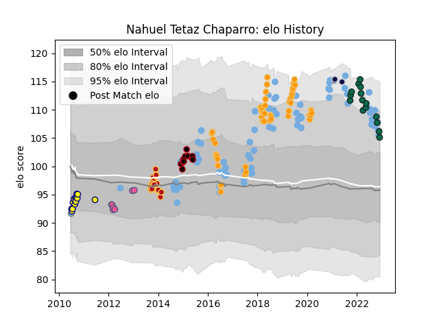

---  
layout: page  
title: Nahuel Tetaz Chaparro  
date: 2023-01-23 15:31:23.184949  
categories: player  
---
# Nahuel Tetaz Chaparro

## Positions: P

## Country: Argentina

## Current elo: 105.0

## Current Percentile: 78.0

# Elo History

# Match History

| Team                 |   Appearances |   Win Rate |
|:---------------------|--------------:|-----------:|
| Argentina            |            76 |   0.328947 |
| Jaguares             |            50 |   0.56     |
| Benetton Treviso     |            18 |   0.416667 |
| Dragons              |            18 |   0.333333 |
| La Plata             |            14 |   0.714286 |
| Lyon                 |            11 |   0.409091 |
| Stade Francais Paris |             8 |   0.3125   |
| Bristol Rugby        |             4 |   0.5      |
| Argentina Jaguares   |             1 |   0        |

| Opponent                 |   Matches |   Win Rate |
|:-------------------------|----------:|-----------:|
| South Africa             |        15 |  0.2       |
| Australia                |        14 |  0.321429  |
| New Zealand              |        13 |  0.0769231 |
| Scotland                 |         8 |  0.25      |
| Sharks                   |         8 |  0.375     |
| Lions                    |         6 |  0.5       |
| France                   |         5 |  0.6       |
| Wales                    |         5 |  0.3       |
| Stormers                 |         5 |  0.6       |
| England                  |         5 |  0.2       |
| Bulls                    |         5 |  0.8       |
| Chiefs                   |         4 |  0.5       |
| Edinburgh                |         4 |  0.5       |
| Italy                    |         4 |  1         |
| Glasgow Warriors         |         3 |  0.333333  |
| Crusaders                |         3 |  0         |
| New South Wales Waratahs |         3 |  1         |
| Munster                  |         3 |  0         |
| Hurricanes               |         3 |  0.333333  |
| Connacht                 |         3 |  0         |
| Southern Kings           |         3 |  0.333333  |
| Cardiff Blues            |         3 |  0.666667  |
| Brumbies                 |         3 |  1         |
| Stade Francais Paris     |         3 |  0.666667  |
| Toulon                   |         3 |  0.166667  |
| Bayonne                  |         3 |  0.333333  |
| Leinster                 |         3 |  0         |
| Scarlets                 |         2 |  0.5       |
| Melbourne Rebels         |         2 |  1         |
| Sale Sharks              |         2 |  0         |
| Romania                  |         2 |  0.5       |
| Queensland Reds          |         2 |  0.5       |
| Ospreys                  |         2 |  0         |
| Newman                   |         2 |  1         |
| Stade Toulousain         |         2 |  0         |
| Sunwolves                |         2 |  0.5       |
| Zebre                    |         2 |  1         |
| Georgia                  |         2 |  1         |
| Atlético del Rosario     |         2 |  0.75      |
| Grenoble                 |         2 |  0.5       |
| Ireland                  |         2 |  0         |
| Bordeaux Begles          |         1 |  0         |
| Dragons                  |         1 |  0.5       |
| Clermont Auvergne        |         1 |  1         |
| Cheetahs                 |         1 |  1         |
| Champagnat               |         1 |  1         |
| Cavalieri Prato          |         1 |  1         |
| Brive                    |         1 |  0         |
| Lomas                    |         1 |  1         |
| San Luis                 |         1 |  1         |
| Biarritz Olympique       |         1 |  0         |
| Tonga                    |         1 |  1         |
| Belgrano                 |         1 |  0         |
| Ulster                   |         1 |  1         |
| United States of America |         1 |  1         |
| Bath Rugby               |         1 |  0         |
| Blues                    |         1 |  1         |
| SIC                      |         1 |  1         |
| Lyon                     |         1 |  1         |
| Gloucester Rugby         |         1 |  1         |
| Racing 92                |         1 |  0         |
| Pucara                   |         1 |  0.5       |
| Oyonnax                  |         1 |  0         |
| Highlanders              |         1 |  0         |
| Olivos                   |         1 |  1         |
| Hindu                    |         1 |  0         |
| Newcastle Falcons        |         1 |  0         |
| La Rochelle              |         1 |  0.5       |
| Leicester Tigers         |         1 |  1         |
| Montpellier Herault      |         1 |  1         |
| Mogliano                 |         1 |  1         |
| Manuel Belgrano          |         1 |  1         |
| Alumni                   |         1 |  0         |