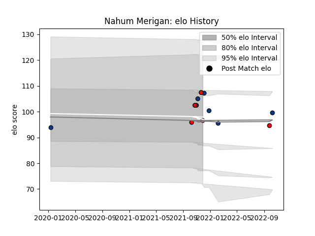

---  
layout: page  
title: Nahum Merigan  
date: 2023-03-21 18:09:25.133686  
categories: player  
---
# Nahum Merigan

Last updated: 2023-03-21
## Positions: N8

## Current elo: 97.0

## Current Percentile: 75.0

# Elo History

# Match History

| Team             |   Appearances |   Win Rate |
|:-----------------|--------------:|-----------:|
| Bath Rugby       |             7 |        0   |
| Hartpury College |             5 |        0.6 |

| Opponent            |   Matches |   Win Rate |
|:--------------------|----------:|-----------:|
| Gloucester Rugby    |         2 |          0 |
| Ampthill            |         1 |          1 |
| Coventry            |         1 |          1 |
| Doncaster           |         1 |          0 |
| Ealing Trailfinders |         1 |          0 |
| Harlequins          |         1 |          0 |
| Leicester Tigers    |         1 |          0 |
| London Scottish     |         1 |          1 |
| Northampton Saints  |         1 |          0 |
| Saracens            |         1 |          0 |
| Wasps               |         1 |          0 |