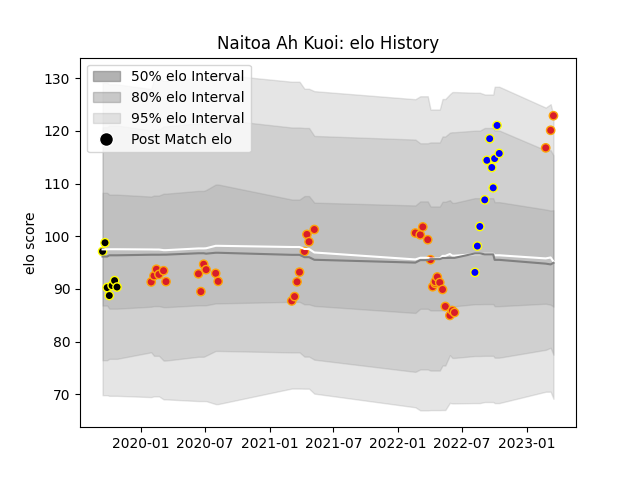

---  
layout: page  
title: Naitoa Ah Kuoi  
date: 2023-03-21 18:01:28.513704  
categories: player  
---
# Naitoa Ah Kuoi

Last updated: 2023-03-21
## Positions: L, FL

## Current elo: 123.0

## Current Percentile: 92.0

# Elo History

# Match History

| Team          |   Appearances |   Win Rate |
|:--------------|--------------:|-----------:|
| Chiefs        |            38 |   0.578947 |
| Bay of Plenty |            11 |   0.636364 |
| Wellington    |             7 |   0.714286 |

| Opponent                 |   Matches |   Win Rate |
|:-------------------------|----------:|-----------:|
| Crusaders                |        10 |   0.4      |
| Hurricanes               |         6 |   0.5      |
| Highlanders              |         5 |   0.6      |
| Blues                    |         5 |   0.4      |
| New South Wales Waratahs |         3 |   1        |
| Waikato                  |         3 |   0.666667 |
| Moana Pasifika           |         2 |   1        |
| Otago                    |         2 |   1        |
| Northland                |         2 |   0.5      |
| North Harbour            |         2 |   0.5      |
| Auckland                 |         2 |   1        |
| Melbourne Rebels         |         2 |   1        |
| Canterbury               |         2 |   0.5      |
| Brumbies                 |         2 |   0        |
| Hawke's Bay              |         1 |   1        |
| Fijian Drua              |         1 |   1        |
| Queensland Reds          |         1 |   1        |
| Southland                |         1 |   1        |
| Sunwolves                |         1 |   1        |
| Taranaki                 |         1 |   1        |
| Tasman                   |         1 |   0        |
| Wellington               |         1 |   0        |