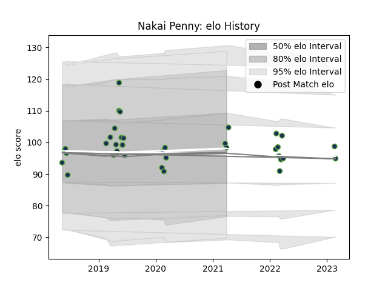

---  
layout: page  
title: Nakai Penny  
date: 2023-03-17 17:03:31.958970  
categories: player  
---
# Nakai Penny

## Positions: FL

## Current elo: 98.0

## Current Percentile: None

# Elo History

# Match History

| Team              |   Appearances |   Win Rate |
|:------------------|--------------:|-----------:|
| Seattle Seawolves |            38 |   0.671053 |

| Opponent               |   Matches |   Win Rate |
|:-----------------------|----------:|-----------:|
| Houston SaberCats      |         5 |   0.6      |
| Toronto Arrows         |         5 |   0.6      |
| Utah Warriors          |         5 |   0.7      |
| NOLA Gold              |         4 |   0.75     |
| Austin Elite Rugby     |         3 |   1        |
| San Diego Legion       |         3 |   0.666667 |
| Dallas Jackals         |         2 |   1        |
| Glendale Raptors       |         2 |   0.5      |
| L. A. Giltinis         |         2 |   0        |
| Rugby New York         |         2 |   1        |
| Austin Gilgronis       |         1 |   0        |
| New England Free Jacks |         1 |   1        |
| Old Glory DC           |         1 |   0        |
| R.U. New York          |         1 |   1        |
| Rugby ATL              |         1 |   1        |