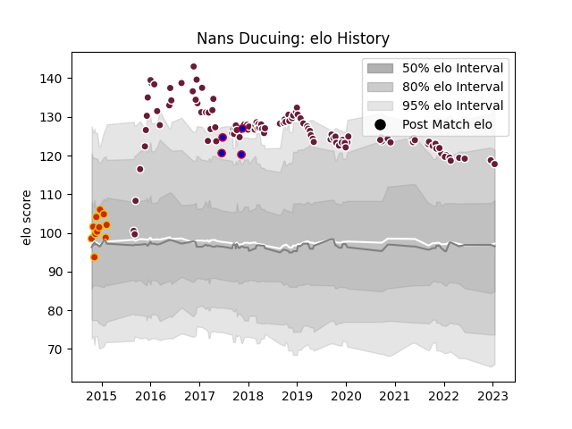

---  
layout: page  
title: Nans Ducuing  
date: 2023-01-15 11:49:20.602191  
categories: player  
---
# Nans Ducuing

## Positions: FB, W

## Country: France

## Current elo: 118.0

## Current Percentile: 87.0

# Elo History

# Match History

| Team            |   Appearances |   Win Rate |
|:----------------|--------------:|-----------:|
| Bordeaux Begles |           112 |   0.513393 |
| Perpignan       |            11 |   0.5      |
| France          |             4 |   0        |

| Opponent             |   Matches |   Win Rate |
|:---------------------|----------:|-----------:|
| Racing 92            |        10 |   0.4      |
| Toulon               |         8 |   0.25     |
| Montpellier Herault  |         8 |   0.5625   |
| Castres Olympique    |         8 |   0.375    |
| Clermont Auvergne    |         8 |   0.4375   |
| Agen                 |         7 |   1        |
| La Rochelle          |         7 |   0.571429 |
| Stade Francais Paris |         7 |   0.714286 |
| Pau                  |         7 |   0.571429 |
| Brive                |         6 |   0.666667 |
| Stade Toulousain     |         4 |   0.375    |
| Lyon                 |         4 |   0.5      |
| Perpignan            |         3 |   0.666667 |
| Exeter Chiefs        |         3 |   0.333333 |
| Grenoble             |         3 |   0.666667 |
| Bayonne              |         3 |   0.666667 |
| South Africa         |         3 |   0        |
| Biarritz Olympique   |         3 |   0.333333 |
| Oyonnax              |         3 |   0.333333 |
| Edinburgh            |         2 |   1        |
| Sharks               |         2 |   0        |
| Newcastle Falcons    |         2 |   0        |
| Connacht             |         1 |   0        |
| Ulster               |         1 |   1        |
| Aurillac             |         1 |   0.5      |
| Beziers              |         1 |   1        |
| Scarlets             |         1 |   1        |
| Ospreys              |         1 |   0        |
| Bourgoin-Jallieu     |         1 |   1        |
| Dax                  |         1 |   0        |
| New Zealand          |         1 |   0        |
| Narbonne             |         1 |   1        |
| Bristol Rugby        |         1 |   0        |
| Mont-de-Marsan       |         1 |   0        |
| Albi                 |         1 |   1        |
| Leicester Tigers     |         1 |   0        |
| Colomiers            |         1 |   0        |
| Wasps                |         1 |   1        |