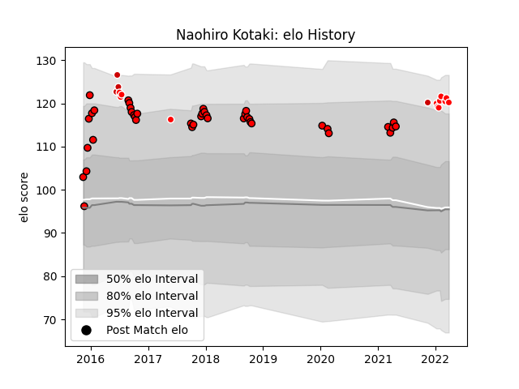

---  
layout: page  
title: Naohiro Kotaki  
date: 2022-12-28 12:55:26.515451  
categories: player  
---
# Naohiro Kotaki

## Positions: L

## Country: Japan

## Current elo: 97.0

## Current Percentile: 55.0

# Elo History

# Match History

| Team                      |   Appearances |   Win Rate |
|:--------------------------|--------------:|-----------:|
| Toshiba Brave Lupus Tokyo |            20 |       0.45 |
| Kobelco Kobe Steelers     |            10 |       0.4  |
| Japan                     |             4 |       0.5  |
| Sunwolves                 |             4 |       0    |

| Opponent                          |   Matches |   Win Rate |
|:----------------------------------|----------:|-----------:|
| Yokohama Canon Eagles             |         4 |   0.25     |
| Kubota Spears Funabashi Tokyo-Bay |         3 |   0.666667 |
| Shizuoka Blue Revs                |         3 |   0.333333 |
| Saitama Wild Knights              |         3 |   0        |
| Black Rams Tokyo                  |         3 |   0.666667 |
| Green Rockets Tokatsu             |         2 |   1        |
| Mie Honda Heat                    |         2 |   0.5      |
| Coca-Cola Red Sparks              |         2 |   1        |
| Scotland                          |         2 |   0        |
| Sharks                            |         2 |   0        |
| Tokyo Sungoliath                  |         2 |   0.5      |
| Hanazono Kintetsu Liners          |         1 |   1        |
| Kobelco Kobe Steelers             |         1 |   0        |
| Munakata Sanix Blues              |         1 |   0        |
| Bulls                             |         1 |   0        |
| Portugal                          |         1 |   1        |
| Canada                            |         1 |   1        |
| Toshiba Brave Lupus Tokyo         |         1 |   0        |
| Toyota Industries Shuttles Aichi  |         1 |   0        |
| Urayasu D-Rocks                   |         1 |   0        |
| New South Wales Waratahs          |         1 |   0        |