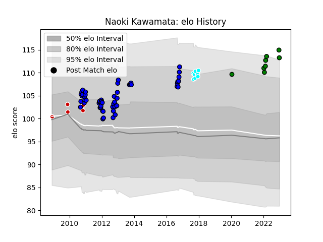

---  
layout: page  
title: Naoki Kawamata  
date: 2023-01-13 11:38:08.665611  
categories: player  
---
# Naoki Kawamata

## Positions: P

## Country: Japan

## Current elo: 103.0

## Current Percentile: 75.0

# Elo History

# Match History

| Team                             |   Appearances |   Win Rate |
|:---------------------------------|--------------:|-----------:|
| Saitama Wild Knights             |            51 |   0.813725 |
| Mitsubishi Dynaboars             |             9 |   0.777778 |
| Toyota Industries Shuttles Aichi |             8 |   0.25     |
| Japan                            |             5 |   0.8      |

| Opponent                          |   Matches |   Win Rate |
|:----------------------------------|----------:|-----------:|
| Black Rams Tokyo                  |         6 |   0.833333 |
| Shizuoka Blue Revs                |         6 |   0.583333 |
| Hanazono Kintetsu Liners          |         6 |   1        |
| Coca-Cola Red Sparks              |         5 |   1        |
| Green Rockets Tokatsu             |         5 |   0.8      |
| Urayasu D-Rocks                   |         5 |   0.6      |
| Kobelco Kobe Steelers             |         4 |   1        |
| Toyota Verblitz                   |         4 |   0.75     |
| Toshiba Brave Lupus Tokyo         |         4 |   0.5      |
| Tokyo Sungoliath                  |         4 |   0        |
| Munakata Sanix Blues              |         4 |   1        |
| Yokohama Canon Eagles             |         3 |   0.666667 |
| NTT Docomo Red Hurricanes Osaka   |         3 |   0.666667 |
| Canada                            |         2 |   1        |
| Saitama Wild Knights              |         2 |   0        |
| Mie Honda Heat                    |         2 |   1        |
| Samoa                             |         1 |   0        |
| Skyactivs Hiroshima               |         1 |   1        |
| Kyuden Voltex                     |         1 |   1        |
| Toyota Industries Shuttles Aichi  |         1 |   1        |
| Kubota Spears Funabashi Tokyo-Bay |         1 |   1        |
| United States of America          |         1 |   1        |
| Hino Red Dolphins                 |         1 |   1        |
| Russia                            |         1 |   1        |