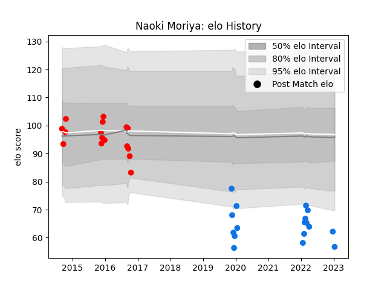

---  
layout: page  
title: Naoki Moriya  
date: 2023-03-21 18:18:18.369031  
categories: player  
---
# Naoki Moriya

Last updated: 2023-03-21
## Positions: W, FB

## Current elo: 57.0

## Current Percentile: 2.0

# Elo History

# Match History

| Team                  |   Appearances |   Win Rate |
|:----------------------|--------------:|-----------:|
| Shimizu Blue Sharks   |            23 |   0.26087  |
| Yokohama Canon Eagles |            19 |   0.421053 |

| Opponent                         |   Matches |   Win Rate |
|:---------------------------------|----------:|-----------:|
| Coca-Cola Red Sparks             |         5 |   0.6      |
| Toyota Industries Shuttles Aichi |         4 |   0.25     |
| Kamaishi Seawaves                |         3 |   0.333333 |
| Kobelco Kobe Steelers            |         3 |   0        |
| Kyuden Voltex                    |         3 |   0.333333 |
| Tokyo Sungoliath                 |         2 |   0        |
| Hanazono Kintetsu Liners         |         2 |   0.5      |
| Kurita Water Gush                |         2 |   0.5      |
| Chugoku Red Regulions            |         2 |   1        |
| Mie Honda Heat                   |         2 |   0        |
| Munakata Sanix Blues             |         2 |   0.5      |
| NTT Docomo Red Hurricanes Osaka  |         2 |   1        |
| Shizuoka Blue Revs               |         2 |   0        |
| Black Rams Tokyo                 |         1 |   0        |
| Toyota Verblitz                  |         1 |   0        |
| Toshiba Brave Lupus Tokyo        |         1 |   0        |
| Mazda Blue Zoomers               |         1 |   0        |
| Saitama Wild Knights             |         1 |   0        |
| Hino Red Dolphins                |         1 |   0        |
| Green Rockets Tokatsu            |         1 |   1        |
| Urayasu D-Rocks                  |         1 |   0        |