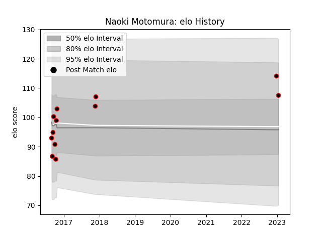

---  
layout: page  
title: Naoki Motomura  
date: 2022-12-28 12:57:17.388684  
categories: player  
---
# Naoki Motomura

## Positions: FB, W

## Current elo: 101.0

## Current Percentile: None

# Elo History

# Match History

| Team           |   Appearances |   Win Rate |
|:---------------|--------------:|-----------:|
| Mie Honda Heat |            11 |   0.272727 |

| Opponent                          |   Matches |   Win Rate |
|:----------------------------------|----------:|-----------:|
| Coca-Cola Red Sparks              |         1 |          0 |
| Hino Red Dolphins                 |         1 |          1 |
| Kamaishi Seawaves                 |         1 |          1 |
| Kobelco Kobe Steelers             |         1 |          0 |
| Kubota Spears Funabashi Tokyo-Bay |         1 |          0 |
| Mitsubishi Dynaboars              |         1 |          1 |
| Munakata Sanix Blues              |         1 |          0 |
| Shizuoka Blue Revs                |         1 |          0 |
| Tokyo Sungoliath                  |         1 |          0 |
| Toshiba Brave Lupus Tokyo         |         1 |          0 |
| Toyota Verblitz                   |         1 |          0 |