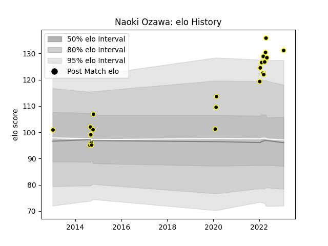

---  
layout: page  
title: Naoki Ozawa  
date: 2023-01-25 18:58:40.967898  
categories: player  
---
# Naoki Ozawa

## Positions: FL, H

## Current elo: 131.0

## Current Percentile: 95.0

# Elo History

# Match History

| Team             |   Appearances |   Win Rate |
|:-----------------|--------------:|-----------:|
| Tokyo Sungoliath |            22 |   0.863636 |

| Opponent                          |   Matches |   Win Rate |
|:----------------------------------|----------:|-----------:|
| Kobelco Kobe Steelers             |         3 |   0.666667 |
| NTT Docomo Red Hurricanes Osaka   |         3 |   1        |
| Toyota Verblitz                   |         3 |   1        |
| Hanazono Kintetsu Liners          |         2 |   1        |
| Toshiba Brave Lupus Tokyo         |         2 |   0.5      |
| Yokohama Canon Eagles             |         2 |   1        |
| Black Rams Tokyo                  |         1 |   1        |
| Coca-Cola Red Sparks              |         1 |   1        |
| Green Rockets Tokatsu             |         1 |   1        |
| Hino Red Dolphins                 |         1 |   1        |
| Kubota Spears Funabashi Tokyo-Bay |         1 |   1        |
| Saitama Wild Knights              |         1 |   0        |
| Shizuoka Blue Revs                |         1 |   1        |