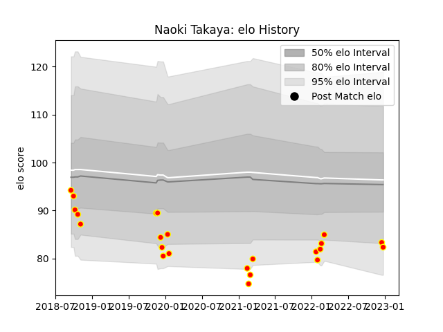

---  
layout: page  
title: Naoki Takaya  
date: 2023-01-13 11:31:11.216703  
categories: player  
---
# Naoki Takaya

## Positions: W, FH

## Current elo: 90.0

## Current Percentile: 31.0

# Elo History

# Match History

| Team          |   Appearances |   Win Rate |
|:--------------|--------------:|-----------:|
| Kyuden Voltex |            24 |   0.333333 |

| Opponent                         |   Matches |   Win Rate |
|:---------------------------------|----------:|-----------:|
| Chugoku Red Regulions            |         3 |   1        |
| Kurita Water Gush                |         3 |   0.333333 |
| Shimizu Blue Sharks              |         3 |   0.666667 |
| Toyota Industries Shuttles Aichi |         3 |   0        |
| Coca-Cola Red Sparks             |         2 |   0        |
| Hanazono Kintetsu Liners         |         2 |   0        |
| Kamaishi Seawaves                |         2 |   0.5      |
| NTT Docomo Red Hurricanes Osaka  |         2 |   0        |
| Mazda Blue Zoomers               |         1 |   0        |
| Mitsubishi Dynaboars             |         1 |   0        |
| Munakata Sanix Blues             |         1 |   0        |
| Skyactivs Hiroshima              |         1 |   1        |