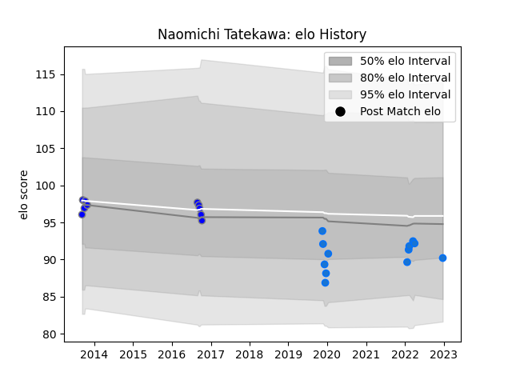

---  
layout: page  
title: Naomichi Tatekawa  
date: 2022-12-31 16:27:33.408671  
categories: player  
---
# Naomichi Tatekawa

## Positions: H

## Current elo: 89.0

## Current Percentile: 26.0

# Elo History

# Match History

| Team                              |   Appearances |   Win Rate |
|:----------------------------------|--------------:|-----------:|
| Shimizu Blue Sharks               |            12 |       0.25 |
| Kubota Spears Funabashi Tokyo-Bay |            10 |       0.5  |

| Opponent                         |   Matches |   Win Rate |
|:---------------------------------|----------:|-----------:|
| Hanazono Kintetsu Liners         |         3 |   0.333333 |
| Coca-Cola Red Sparks             |         2 |   0.5      |
| Kurita Water Gush                |         2 |   0.5      |
| Kyuden Voltex                    |         2 |   0        |
| Munakata Sanix Blues             |         2 |   0.5      |
| Toshiba Brave Lupus Tokyo        |         2 |   0        |
| Toyota Industries Shuttles Aichi |         2 |   0.5      |
| Chugoku Red Regulions            |         1 |   1        |
| Mazda Blue Zoomers               |         1 |   0        |
| Mie Honda Heat                   |         1 |   1        |
| Saitama Wild Knights             |         1 |   0        |
| Shizuoka Blue Revs               |         1 |   0        |
| Urayasu D-Rocks                  |         1 |   0        |
| Yokohama Canon Eagles            |         1 |   1        |