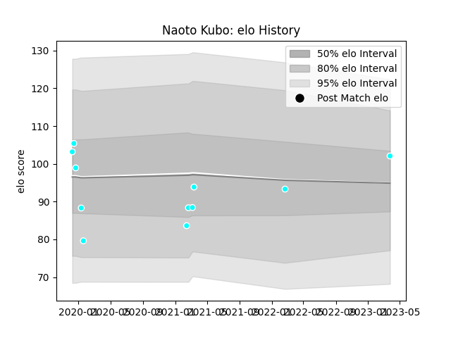

---  
layout: page  
title: Naoto Kubo  
date: 2023-03-27 11:37:18.798366  
categories: player  
---
# Naoto Kubo

Last updated: 2023-03-27
## Positions: W

## Current elo: 102.0

## Current Percentile: None

# Elo History

# Match History

| Team                             |   Appearances |   Win Rate |
|:---------------------------------|--------------:|-----------:|
| Toyota Industries Shuttles Aichi |            11 |   0.909091 |

| Opponent              |   Matches |   Win Rate |
|:----------------------|----------:|-----------:|
| Shimizu Blue Sharks   |         3 |        1   |
| Coca-Cola Red Sparks  |         2 |        0.5 |
| Kyuden Voltex         |         2 |        1   |
| Chugoku Red Regulions |         1 |        1   |
| Kamaishi Seawaves     |         1 |        1   |
| Kurita Water Gush     |         1 |        1   |
| Skyactivs Hiroshima   |         1 |        1   |