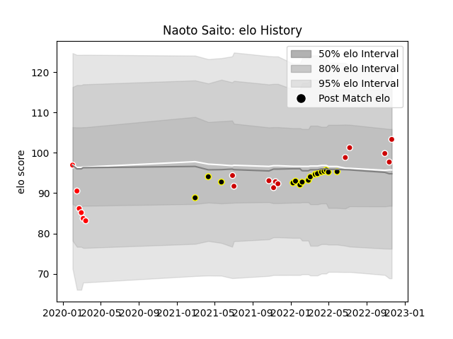

---  
layout: page  
title: Naoto Saito  
date: 2022-11-22 11:41:59.426247  
categories: player  
---
# Naoto Saito

## Positions: SH

## Country: Japan

## Current elo: 94.0

## Current Percentile: 36.0

# Elo History

# Match History

| Team             |   Appearances |   Win Rate |
|:-----------------|--------------:|-----------:|
| Japan            |             8 |   0.25     |
| Sunwolves        |             6 |   0.166667 |
| Tokyo Sungoliath |             6 |   1        |

| Opponent                        |   Matches |   Win Rate |
|:--------------------------------|----------:|-----------:|
| France                          |         2 |          0 |
| NTT Docomo Red Hurricanes Osaka |         2 |          1 |
| Black Rams Tokyo                |         2 |          1 |
| Australia                       |         1 |          0 |
| Melbourne Rebels                |         1 |          1 |
| Urayasu D-Rocks                 |         1 |          1 |
| Queensland Reds                 |         1 |          0 |
| Portugal                        |         1 |          1 |
| New Zealand                     |         1 |          0 |
| Ireland                         |         1 |          0 |
| Kobelco Kobe Steelers           |         1 |          1 |
| Hurricanes                      |         1 |          0 |
| England                         |         1 |          0 |
| Crusaders                       |         1 |          0 |
| Chiefs                          |         1 |          0 |
| Brumbies                        |         1 |          0 |
| Uruguay                         |         1 |          1 |