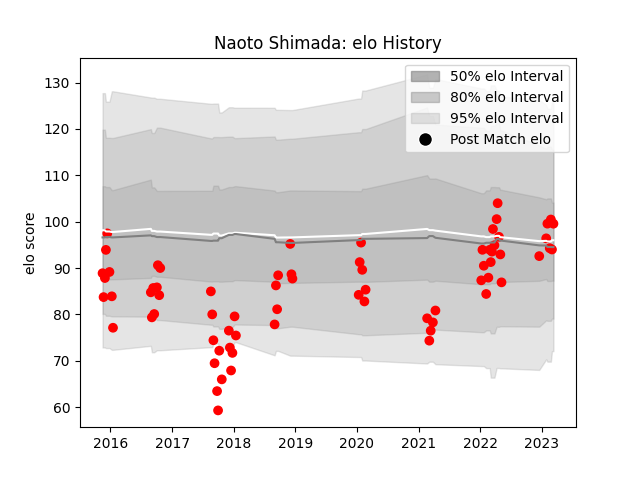

---  
layout: page  
title: Naoto Shimada  
date: 2023-02-02 18:56:03.586046  
categories: player  
---
# Naoto Shimada

## Positions: FL

## Current elo: 70.0

## Current Percentile: 5.0

# Elo History

# Match History

| Team                  |   Appearances |   Win Rate |
|:----------------------|--------------:|-----------:|
| Yokohama Canon Eagles |            55 |   0.481818 |

| Opponent                          |   Matches |   Win Rate |
|:----------------------------------|----------:|-----------:|
| Kobelco Kobe Steelers             |         7 |   0.428571 |
| Saitama Wild Knights              |         7 |   0        |
| Green Rockets Tokatsu             |         6 |   0.833333 |
| Black Rams Tokyo                  |         5 |   0.4      |
| Shizuoka Blue Revs                |         5 |   0.4      |
| Coca-Cola Red Sparks              |         3 |   1        |
| Kubota Spears Funabashi Tokyo-Bay |         3 |   0.333333 |
| NTT Docomo Red Hurricanes Osaka   |         3 |   0.666667 |
| Tokyo Sungoliath                  |         3 |   0        |
| Toshiba Brave Lupus Tokyo         |         3 |   0.333333 |
| Toyota Industries Shuttles Aichi  |         3 |   1        |
| Mie Honda Heat                    |         2 |   0.25     |
| Toyota Verblitz                   |         2 |   0.5      |
| Mitsubishi Dynaboars              |         1 |   1        |
| Munakata Sanix Blues              |         1 |   1        |
| Urayasu D-Rocks                   |         1 |   1        |