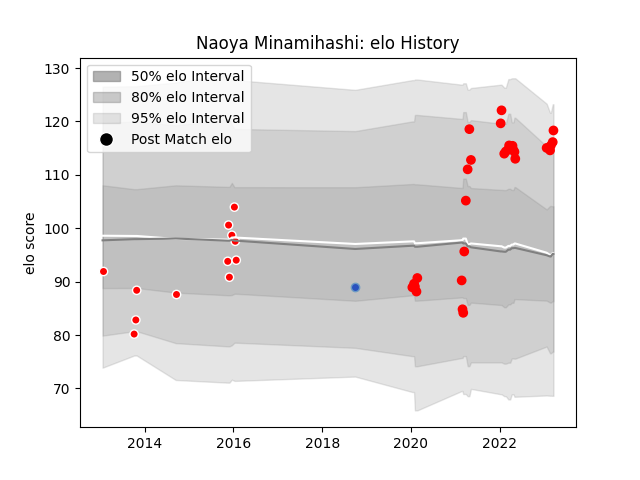

---  
layout: page  
title: Naoya Minamihashi  
date: 2023-01-21 15:39:27.257033  
categories: player  
---
# Naoya Minamihashi

## Positions: C

## Current elo: 126.0

## Current Percentile: 93.0

# Elo History

# Match History

| Team                  |   Appearances |   Win Rate |
|:----------------------|--------------:|-----------:|
| Yokohama Canon Eagles |            24 |   0.583333 |
| Kobelco Kobe Steelers |             5 |   0.8      |

| Opponent                          |   Matches |   Win Rate |
|:----------------------------------|----------:|-----------:|
| Green Rockets Tokatsu             |         6 |       1    |
| Kobelco Kobe Steelers             |         4 |       0.25 |
| NTT Docomo Red Hurricanes Osaka   |         4 |       0.5  |
| Saitama Wild Knights              |         3 |       0    |
| Shizuoka Blue Revs                |         3 |       1    |
| Kubota Spears Funabashi Tokyo-Bay |         2 |       0.5  |
| Black Rams Tokyo                  |         1 |       1    |
| Mie Honda Heat                    |         1 |       0    |
| Munakata Sanix Blues              |         1 |       1    |
| Tokyo Sungoliath                  |         1 |       0    |
| Toyota Verblitz                   |         1 |       1    |
| Urayasu D-Rocks                   |         1 |       1    |
| Yokohama Canon Eagles             |         1 |       1    |