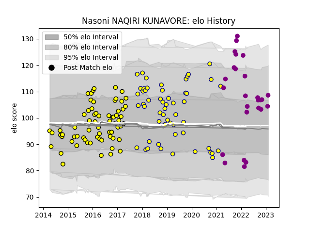

---  
layout: page  
title: Nasoni NAQIRI KUNAVORE  
date: 2023-02-17 14:42:25.486631  
categories: player  
---
# Nasoni NAQIRI KUNAVORE

## Positions: C, W

## Current elo: 111.0

## Current Percentile: 88.0

# Elo History

# Match History

| Team             |   Appearances |   Win Rate |
|:-----------------|--------------:|-----------:|
| Albi             |            68 |   0.419118 |
| Nevers           |            55 |   0.572727 |
| Soyaux-Angouleme |            27 |   0.444444 |

| Opponent                   |   Matches |   Win Rate |
|:---------------------------|----------:|-----------:|
| Mont-de-Marsan             |        12 |   0.333333 |
| Carcassonne                |        11 |   0.681818 |
| Aurillac                   |        11 |   0.454545 |
| Montauban                  |         9 |   0.222222 |
| Massy                      |         7 |   0.714286 |
| Dax                        |         7 |   0.857143 |
| Colomiers                  |         7 |   0.571429 |
| Vannes                     |         7 |   0.285714 |
| Beziers                    |         7 |   0.142857 |
| Soyaux-Angouleme           |         6 |   0.666667 |
| Perpignan                  |         6 |   0.666667 |
| Narbonne                   |         6 |   0.583333 |
| Biarritz Olympique         |         6 |   0.666667 |
| Provence Rugby             |         5 |   0.4      |
| Oyonnax                    |         5 |   0.2      |
| Bayonne                    |         4 |   0        |
| Bourgoin-Jallieu           |         4 |   0.75     |
| Pau                        |         3 |   0.333333 |
| Agen                       |         3 |   0.666667 |
| Grenoble                   |         3 |   0.333333 |
| Lyon                       |         2 |   0        |
| Chambery                   |         2 |   0        |
| Nice                       |         2 |   0.5      |
| Tarbes                     |         2 |   0.5      |
| Valence Romans Drome Rugby |         2 |   0.5      |
| Cognac Saint Jean d'Angély |         2 |   1        |
| Rouen                      |         2 |   0        |
| Suresnes                   |         2 |   1        |
| Brive                      |         1 |   0        |
| Roval Drome XV             |         1 |   1        |
| Dijon                      |         1 |   1        |
| Blagnac                    |         1 |   1        |
| Nevers                     |         1 |   0        |