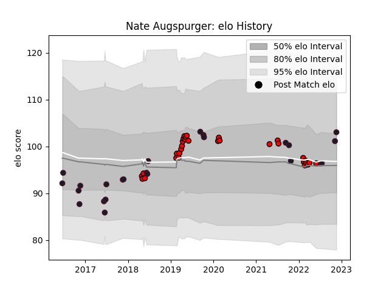

---  
layout: page  
title: Nate Augspurger  
date: 2022-11-22 11:33:09.656887  
categories: player  
---
# Nate Augspurger

## Positions: SH, W

## Country: United States of America

## Current elo: 103.0

## Current Percentile: 71.0

# Elo History

# Match History

| Team                     |   Appearances |   Win Rate |
|:-------------------------|--------------:|-----------:|
| San Diego Legion         |            31 |   0.693548 |
| United States of America |            24 |   0.458333 |

| Opponent               |   Matches |   Win Rate |
|:-----------------------|----------:|-----------:|
| Utah Warriors          |         5 |   1        |
| Canada                 |         5 |   0.9      |
| Seattle Seawolves      |         4 |   0.75     |
| Austin Elite Rugby     |         3 |   0.666667 |
| Glendale Raptors       |         3 |   0.5      |
| Houston SaberCats      |         3 |   1        |
| L. A. Giltinis         |         2 |   0        |
| Toronto Arrows         |         2 |   0        |
| Tonga                  |         2 |   0        |
| Russia                 |         2 |   1        |
| Old Glory DC           |         2 |   0.5      |
| NOLA Gold              |         2 |   1        |
| Chile                  |         2 |   0.5      |
| Georgia                |         2 |   0        |
| Italy                  |         1 |   0        |
| Romania                |         1 |   0        |
| Uruguay                |         1 |   0        |
| Austin Gilgronis       |         1 |   0        |
| Colorado Raptors       |         1 |   1        |
| Scotland               |         1 |   1        |
| Dallas Jackals         |         1 |   1        |
| R.U. New York          |         1 |   1        |
| Kenya                  |         1 |   1        |
| Portugal               |         1 |   0.5      |
| New Zealand Maori      |         1 |   0        |
| New Zealand            |         1 |   0        |
| New England Free Jacks |         1 |   1        |
| Germany                |         1 |   1        |
| Ireland                |         1 |   0        |
| Argentina              |         1 |   0        |