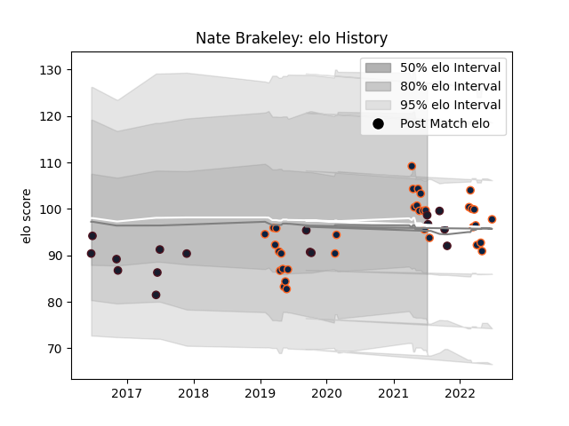

---  
layout: page  
title: Nate Brakeley  
date: 2023-03-21 18:51:14.271716  
categories: player  
---
# Nate Brakeley

Last updated: 2023-03-21
## Positions: L

## Country: United States of America

## Current elo: 99.0

## Current Percentile: 60.0

# Elo History

# Match History

| Team                     |   Appearances |   Win Rate |
|:-------------------------|--------------:|-----------:|
| R.U. New York            |            37 |   0.621622 |
| Rugby New York           |            35 |   0.685714 |
| United States of America |            16 |   0.25     |

| Opponent               |   Matches |   Win Rate |
|:-----------------------|----------:|-----------:|
| Toronto Arrows         |         9 |   0.444444 |
| NOLA Gold              |         9 |   0.666667 |
| San Diego Legion       |         8 |   0.5      |
| New England Free Jacks |         7 |   0.285714 |
| Rugby ATL              |         6 |   0.833333 |
| Old Glory DC           |         6 |   1        |
| Utah Warriors          |         5 |   0.6      |
| Seattle Seawolves      |         5 |   0.6      |
| Houston SaberCats      |         4 |   1        |
| Austin Elite Rugby     |         3 |   1        |
| L. A. Giltinis         |         3 |   0.666667 |
| Glendale Raptors       |         3 |   0.666667 |
| Canada                 |         3 |   1        |
| Ireland                |         2 |   0        |
| Georgia                |         2 |   0        |
| Austin Herd            |         2 |   1        |
| Italy                  |         1 |   0        |
| France                 |         1 |   0        |
| New Zealand            |         1 |   0        |
| New Zealand Maori      |         1 |   0        |
| England                |         1 |   0        |
| Romania                |         1 |   0        |
| Dallas Jackals         |         1 |   1        |
| Russia                 |         1 |   1        |
| Austin Gilgronis       |         1 |   0        |
| Uruguay                |         1 |   0        |
| Argentina              |         1 |   0        |