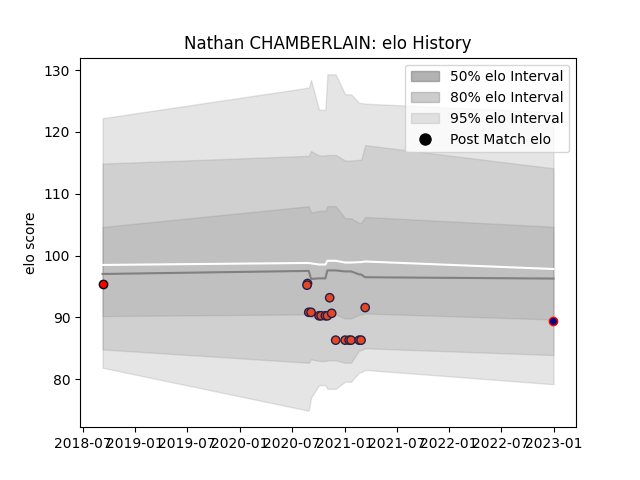

---  
layout: page  
title: Nathan CHAMBERLAIN  
date: 2023-02-06 16:03:43.012306  
categories: player  
---
# Nathan CHAMBERLAIN

## Positions: FH

## Current elo: 88.0

## Current Percentile: 38.0

# Elo History

# Match History

| Team             |   Appearances |   Win Rate |
|:-----------------|--------------:|-----------:|
| Edinburgh        |            18 |   0.388889 |
| London Scottish  |             5 |   0        |
| Hartpury College |             1 |   0        |

| Opponent         |   Matches |   Win Rate |
|:-----------------|----------:|-----------:|
| Glasgow Warriors |         6 |        0.5 |
| Connacht         |         2 |        0.5 |
| Munster          |         2 |        0   |
| Scarlets         |         2 |        0.5 |
| Ulster           |         2 |        0   |
| Ampthill         |         1 |        0   |
| Bedford          |         1 |        0   |
| Cardiff Blues    |         1 |        1   |
| Doncaster        |         1 |        0   |
| Hartpury College |         1 |        0   |
| Jersey           |         1 |        0   |
| Leinster         |         1 |        0   |
| Ospreys          |         1 |        0   |
| Richmond         |         1 |        0   |
| Zebre            |         1 |        1   |